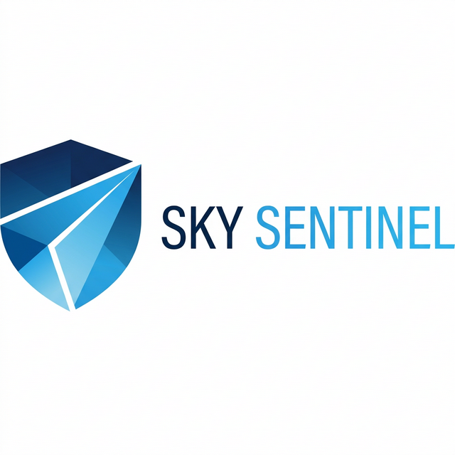
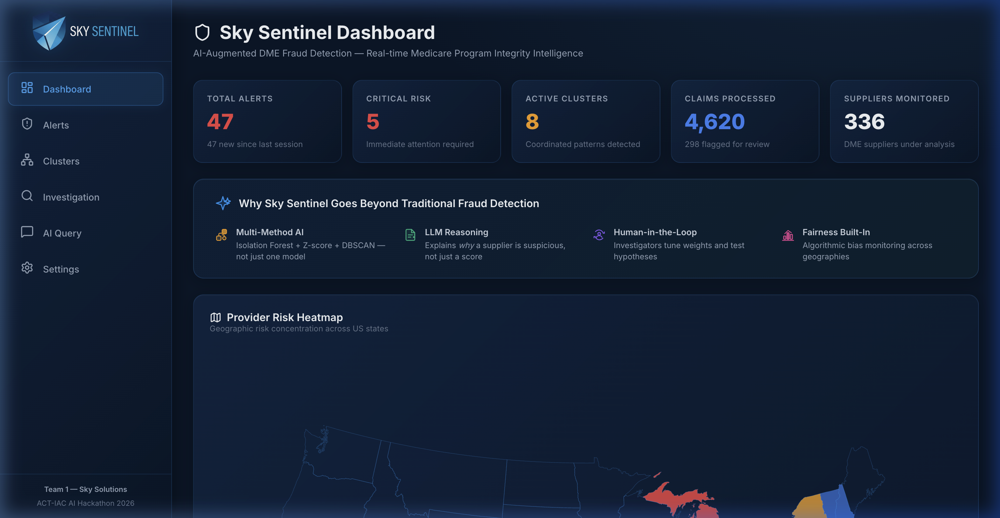
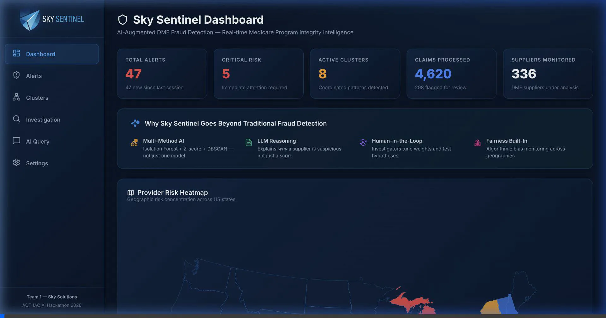
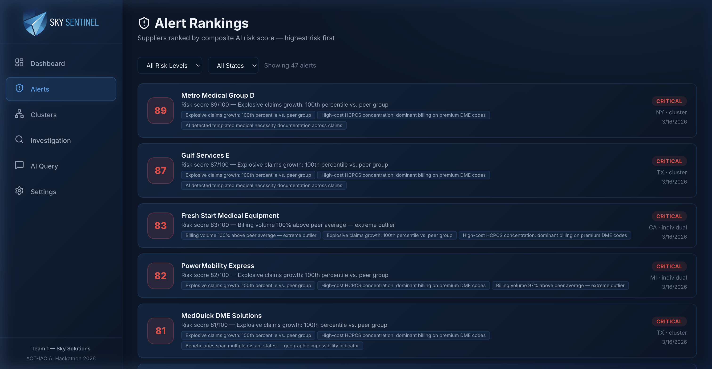
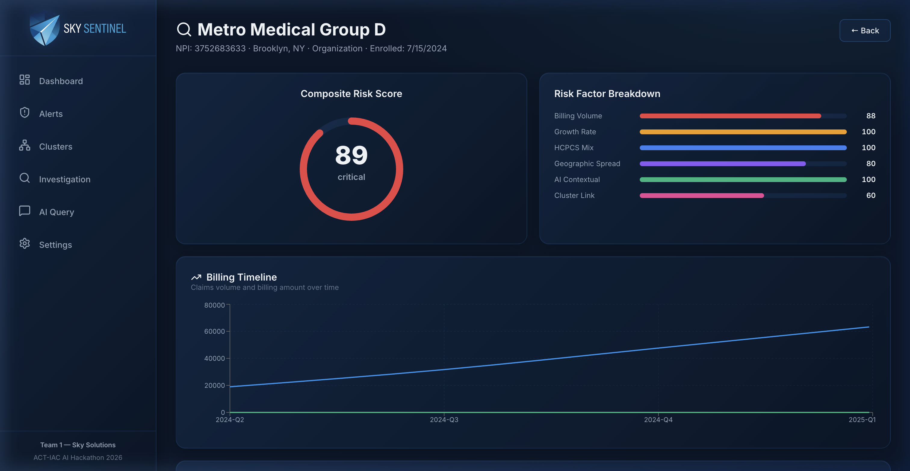
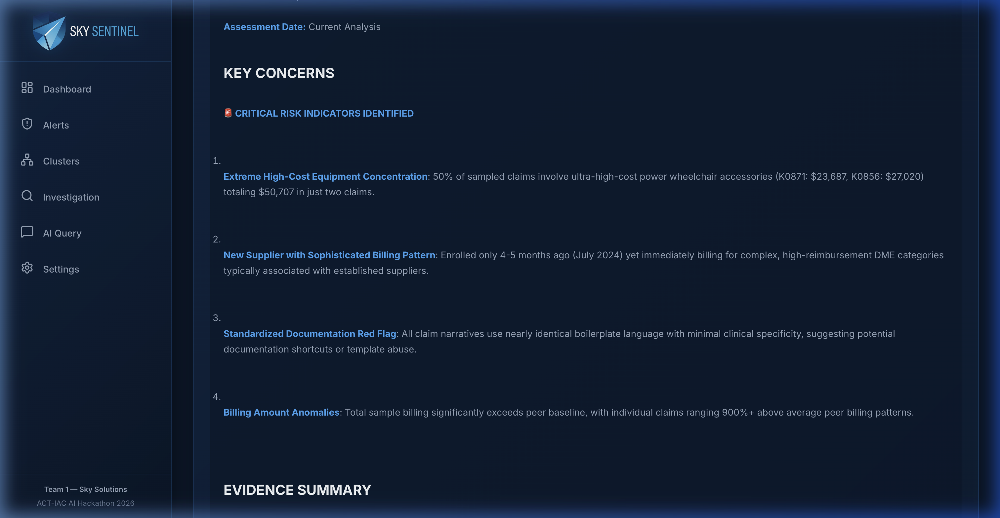
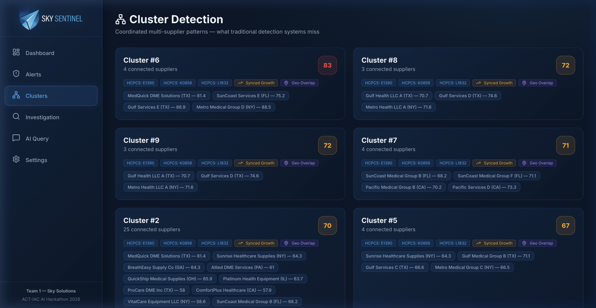
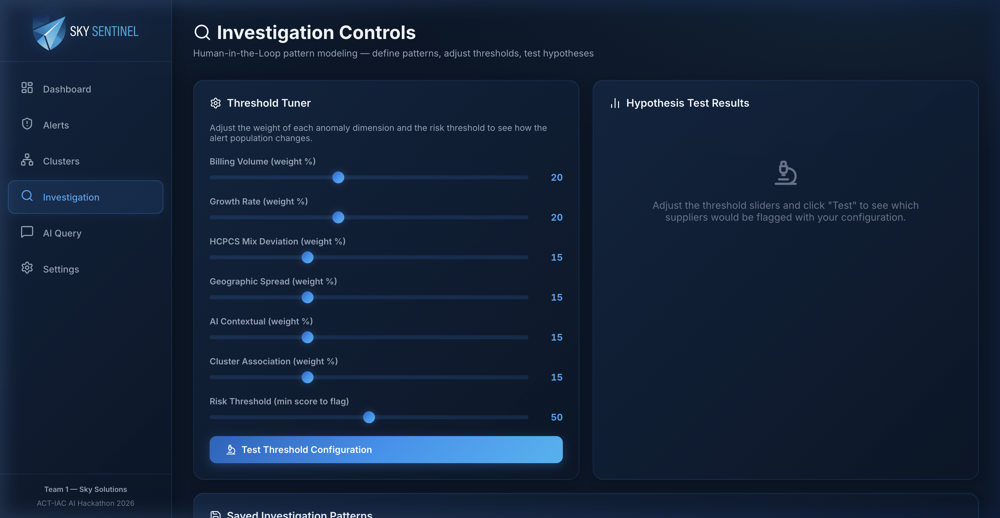
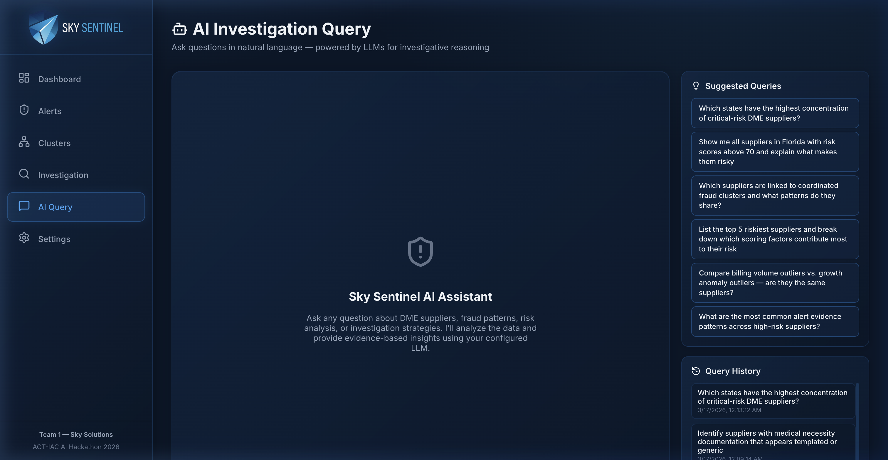
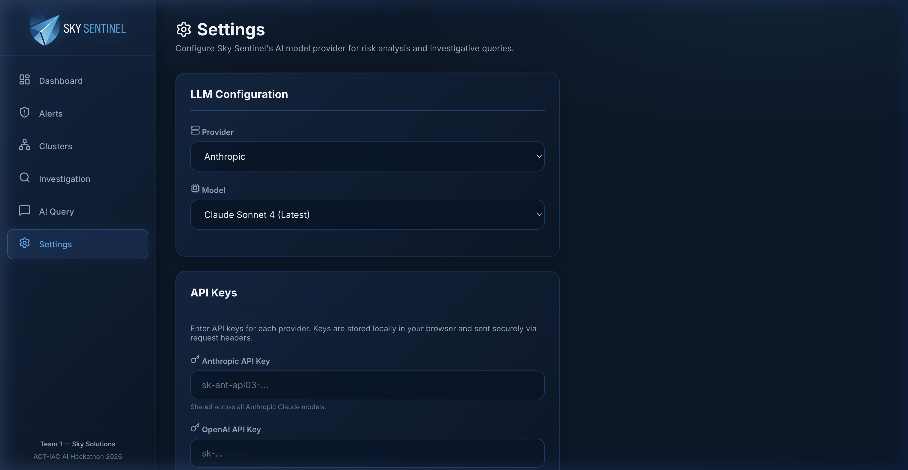

<p align="center">
  
</p>

<h1 align="center">Sky Sentinel</h1>

<p align="center">
  <strong>AI-Augmented DME Fraud Detection — Human-in-the-Loop Pattern Modeling for Medicare Program Integrity</strong>
</p>

<p align="center">
  <em>ACT-IAC AI Hackathon: AI in Action — Team 1 · Sky Solutions</em><br>
  <em>March 27, 2026 · Carahsoft Conference Center, Reston VA</em>
</p>

<p align="center">
  
  
  
  
  
  
</p>

---

## Table of Contents

- [Executive Summary](#executive-summary)
- [The Problem We Solve](#the-problem-we-solve)
- [Why Sky Sentinel Goes Beyond Traditional Detection](#why-sky-sentinel-goes-beyond-traditional-detection)
- [Application Pages](#application-pages)
  - [Dashboard — Command Center](#-dashboard--command-center)
  - [Alert Rankings — Prioritized Risk Queue](#-alert-rankings--prioritized-risk-queue)
  - [Supplier Drill-Down — Investigator Deep Dive](#-supplier-drill-down--investigator-deep-dive)
  - [Cluster Detection — Coordinated Fraud Networks](#-cluster-detection--coordinated-fraud-networks)
  - [Investigation Controls — Human-in-the-Loop](#-investigation-controls--human-in-the-loop-pattern-modeling)
  - [AI Query — Natural Language Investigation](#-ai-query--natural-language-investigation)
  - [Settings — Model Configuration](#-settings--llm-configuration)
- [How the AI/ML Pipeline Works](#how-the-aiml-pipeline-works)
  - [Layer 1: Statistical Anomaly Detection](#layer-1-statistical-anomaly-detection-find-the-outliers)
  - [Layer 2: Behavioral Clustering](#layer-2-behavioral-clustering-find-the-networks)
  - [Layer 3: LLM Contextual Intelligence](#layer-3-llm-contextual-intelligence-explain-the-why)
  - [Composite Risk Scoring](#composite-risk-scoring)
- [Multi-Model LLM Routing](#multi-model-llm-routing)
- [Architecture](#architecture)
- [Data Sources & Rationale](#data-sources--rationale)
- [API Reference](#api-reference)
- [Responsible AI & Fairness](#responsible-ai--fairness)
- [Demo Walkthrough](#demo-walkthrough-5-minutes)
- [Demo Recordings](#demo-recordings)
- [Quick Start](#quick-start)
- [Technology Stack](#technology-stack)
- [Judging Criteria Alignment](#judging-criteria-alignment)
- [Path to CMS Pilot](#path-to-cms-pilot)
- [Future Roadmap](#future-roadmap)
- [Team](#team)
- [Repository Structure](#repository-structure)
- [Acknowledgments](#acknowledgments)

---

## Executive Summary

**Sky Sentinel** is an AI-powered investigation platform that helps Medicare program integrity analysts detect Durable Medical Equipment (DME) fraud that traditional detection systems miss.

Medicare fraud, waste, and abuse cost the U.S. government an estimated **$60+ billion annually**. DME is one of the most exploited categories — high-value items like power wheelchairs ($30,000+), oxygen equipment, and orthotics are easy to fabricate claims for and difficult to verify. Fraudulent DME suppliers operate as shell companies, bill aggressively through coordinated networks, and dissolve before detection.

**The core problem:** Traditional rule-based and single-model ML detection systems analyze each supplier in isolation. Modern fraud schemes are designed to evade these systems by **fragmenting suspicious activity across multiple entities**, keeping each individual supplier just below detection thresholds.

**Sky Sentinel addresses this gap** by combining three detection layers that no traditional system offers together:

| Detection Layer | What It Catches | Traditional Systems |
|---|---|---|
| **Multi-Method ML Anomaly Detection** | Individual suppliers with billing volumes, growth rates, or HCPCS mixes that deviate from peer baselines | ❌ Typically use single-model thresholds |
| **DBSCAN Cluster Analysis** | Coordinated supplier groups with synchronized billing, shared geographies, and overlapping product categories that collectively indicate organized fraud | ❌ Cannot detect multi-entity coordination |
| **LLM Contextual Intelligence** | Narrative risk assessments explaining *why* patterns are suspicious, templated documentation detection, natural language investigation queries | ❌ No unstructured text analysis capability |

Most importantly, Sky Sentinel keeps **investigators in control**. The platform doesn't auto-block or auto-approve — it surfaces suspicious patterns with transparent evidence, then gives analysts the tools to define their own detection criteria, test hypotheses, and make the final call.

> **Sky Sentinel moves program integrity from reactive review to proactive prevention — where AI amplifies human expertise, not replaces it.**

---

## The Problem We Solve

### Why DME Fraud Is Hard to Catch

| Challenge | Description |
|---|---|
| **High-value, easy to fabricate** | DME items like power wheelchairs (HCPCS K0856, ~$30,000) are lucrative targets with documentation that's easy to forge |
| **Shell company exploitation** | Fraudulent suppliers incorporate, bill aggressively for months, then dissolve before review catches up |
| **Coordinated networks** | Criminal organizations operate dozens of DME companies, use nominee owners, and distribute billing across entities to stay under individual thresholds |
| **Telemedicine pipeline** | Cold-call marketers solicit seniors for "free" equipment, then bill Medicare using fraudulent telehealth prescriptions |
| **Templated documentation** | Fraud rings use shared medical necessity templates across multiple NPIs, creating textual patterns invisible to structured data systems |

### What Traditional Detection Misses

Traditional ML-based detection systems (logistic regression, random forest, rule-based thresholds) have fundamental limitations:

- ❌ **Single-supplier focus** — Analyze each provider in isolation; can't detect coordinated multi-NPI schemes
- ❌ **Structured data only** — Process billing codes and dollar amounts but can't read claim narratives or medical necessity justifications
- ❌ **Black-box scores** — Produce numeric flags without explainable reasoning for investigators
- ❌ **Static rules** — Can't adapt to evolving fraud tactics without manual reprogramming
- ❌ **High false positive rates** — Without clinical context, legitimate high-cost providers get flagged alongside real bad actors

**Sky Sentinel fills these exact gaps.**

---

## Why Sky Sentinel Goes Beyond Traditional Detection

### 1. Multi-Method AI — Not Just One Model

Traditional systems typically rely on a **single ML algorithm** (e.g., logistic regression or random forest). Sky Sentinel uses **three complementary detection methods** simultaneously, each catching patterns the others miss:

| Method | What It Is (Plain English) | What It Catches |
|---|---|---|
| **Isolation Forest** | An algorithm that isolates outliers by randomly partitioning data — the easier a data point is to isolate, the more anomalous it is. Unlike threshold-based rules, it detects *combinations* of unusual features that wouldn't individually trigger an alert. | Suppliers with unusual *combinations* of high billing + narrow HCPCS mix + new enrollment date — patterns invisible to single-variable thresholds |
| **Z-Score Analysis** | A statistical measure showing how many standard deviations a supplier's metrics fall from its peer group average. A Z-score of +2.5 means the supplier is 2.5 standard deviations above its peers — highly unusual. | Suppliers whose billing volume, growth rate, or geographic spread significantly deviates from what's normal for their specialty and region |
| **DBSCAN Clustering** | Density-Based Spatial Clustering of Applications with Noise — an algorithm that groups nearby data points in feature space without needing to pre-specify how many groups exist. It naturally discovers clusters of *any shape* and marks lone points as noise. | Groups of suppliers that individually look normal but *collectively* show coordinated billing patterns — synchronized growth, shared HCPCS codes, overlapping territories — classic indicators of organized fraud rings |

> **Why three methods?** Isolation Forest catches individual outliers that Z-scores might miss due to skewed distributions. Z-scores catch peer-relative deviations that Isolation Forest might miss in dense clusters. DBSCAN catches coordinated fraud networks that *neither* individual method can detect, because no single supplier exceeds any threshold.

### 2. LLM-Powered Contextual Analysis

Sky Sentinel uses Claude AI to analyze what structured ML systems fundamentally cannot — the *context* behind the numbers:

**Example from our demo data:**
> *"DME Supplier NPI-3752683633 (Metro Medical Group D) — 50% of sampled claims involve ultra-high-cost power wheelchair accessories (K0871: $23,687, K0856: $27,020) totaling $50,707 in just two claims. Enrolled only 4-5 months ago, yet immediately billing for complex, high-reimbursement DME categories. This concentration is highly unusual for a newly enrolled supplier and represents classic fraud indicators."*

This narrative identifies **specific HCPCS codes and dollar amounts**, connects them to **enrollment timing**, and explains the **fraud pattern** — something no traditional ML score can do.

### 3. Human-in-the-Loop Investigation

Investigators don't just review alerts — they **shape the detection**:
- Adjust anomaly sensitivity across 7 dimensions with interactive sliders
- Define custom detection patterns ("show me new FL suppliers billing >2x peer average for power wheelchairs")
- Test pattern hypotheses against the live dataset before committing changes
- All decisions are logged with timestamps for audit compliance

### 4. Real CMS Data Integration

Sky Sentinel ingests **live data from the CMS Medicare Supplier API** — real NPIs, real geographies, real billing volumes — combined with synthetic fraud scenarios. This isn't a toy demo with fake data; it's production-adjacent intelligence built on actual Medicare provider records.

### 5. Algorithmic Fairness Monitoring

A dedicated Fairness & Bias Review panel on the dashboard monitors alert distributions across geographies, ensuring the system isn't disproportionately flagging suppliers in specific regions without justification.

---

## Application Pages

Sky Sentinel consists of seven interconnected pages, each designed for a specific phase of the investigation workflow.

### 📊 Dashboard — Command Center

<p align="center">
  
</p>

<details>
<summary>🎬 <strong>Dashboard Walkthrough (click to expand)</strong></summary>
<br>
<p align="center">
  
</p>
</details>

The Dashboard provides a real-time operational overview of the entire monitored supplier population.

| Component | Purpose |
|---|---|
| **Metric Cards** | At-a-glance counts: Total Alerts, Critical Risk, Active Clusters, Claims Processed, Suppliers Monitored |
| **AI Approach Banner** | Explains why Sky Sentinel goes beyond traditional fraud detection — Multi-Method AI, LLM Reasoning, Human-in-the-Loop, Fairness Built-In — with custom icons for each pillar |
| **Provider Risk Heatmap** | Interactive US choropleth map showing geographic risk concentration by state, using graduated colors (green → yellow → red) |
| **Fairness & Bias Review** | Monitors alert distribution across geographies to ensure no algorithmic bias in risk flagging |
| **Claims Trend Chart** | Time-series area chart showing total vs. flagged claims over 12 months |
| **Risk Distribution** | Donut chart of alert severity breakdown: Critical, High, Medium |
| **Top DME Categories** | Horizontal bar chart of HCPCS codes by total billed amount |
| **Live Claims Feed** | Real-time streaming view of incoming claims with color-coded status badges |
| **Top Risk Alerts** | Quick-access list of the highest-scoring supplier alerts |
| **Geographic Risk Bar Chart** | State-level bar chart with average risk scores and alert counts |

---

### 🚨 Alert Rankings — Prioritized Risk Queue

<p align="center">
  
</p>

The Alert Rankings page is the analyst's primary work queue — a ranked list of every flagged supplier sorted by composite AI risk score (0–100).

| Feature | Detail |
|---|---|
| **Ranked Alert Cards** | Risk score badge (color-coded), supplier name & NPI, one-line risk summary, evidence tags showing top anomaly drivers |
| **Diversified Evidence Tags** | Each supplier has unique, AI-derived evidence: "Explosive claims growth: 100th percentile vs. peer group", "High-cost HCPCS concentration", "AI detected templated documentation", "Geographic impossibility indicator", "Linked to coordinated supplier network" |
| **Risk Level Filters** | Filter by Critical / High / Medium |
| **State Filters** | Geographic filtering for region-specific investigations |

**Investigation workflow:** An analyst starts each session here, scans the top alerts, and clicks into any supplier for a full deep dive. The diversified evidence tags give enough context for rapid triage.

---

### 🔍 Supplier Drill-Down — Investigator Deep Dive

<p align="center">
  
</p>

<details>
<summary>🎬 <strong>Alert → Drill-Down Investigation Flow (click to expand)</strong></summary>
<br>
<p align="center">
  
</p>
</details>

The most detailed view in the system — a complete investigation dossier for a single supplier.

| Section | What It Shows |
|---|---|
| **Provider Profile** | NPI, organization name, city/state, entity type, enrollment date |
| **Composite Risk Score Gauge** | Animated SVG semicircle gauge (0–100) with color graduation |
| **Risk Factor Breakdown** | Horizontal bar chart decomposing the score into 6 weighted dimensions (see [Composite Risk Scoring](#composite-risk-scoring)) |
| **Billing Timeline** | Line chart showing **4 quarters** (2024-Q2 through 2025-Q1) of claims volume and billing amounts — reveals ramp-up patterns and seasonal anomalies |
| **AI Risk Assessment** | Full LLM-generated narrative analysis with KEY CONCERNS, EVIDENCE SUMMARY, and RECOMMENDED ACTIONS (see below) |
| **Investigator Actions** | Three buttons: **Escalate** (formal investigation), **Monitor** (watchlist), **Dismiss** (false positive) — all logged with timestamps |
| **Recent Claims Table** | Paginated table of individual claims with HCPCS codes, billing amounts, dates, and status |

#### AI Risk Assessment (LLM-Generated Narrative)

<p align="center">
  
</p>

This is **Sky Sentinel's marquee feature** — a full investigative narrative written by AI, analyzing the supplier's data and explaining *why* the patterns are concerning in plain English:

> **Key Concerns Identified:**
> 1. **Extreme High-Cost Equipment Concentration** — 50% of claims involve ultra-high-cost power wheelchair accessories (K0871: $23,687, K0856: $27,020) totaling $50,707 in just two claims
> 2. **New Supplier with Sophisticated Billing** — Enrolled only 4–5 months ago but immediately billing for complex, high-reimbursement DME categories
> 3. **Cluster Association** — Linked to a coordinated network of suppliers with synchronized billing patterns
> 4. **Recommended Action** — Immediate further review warranted; consider coordinated review with related NPIs

---

### 🕸️ Cluster Detection — Coordinated Fraud Networks

<p align="center">
  
</p>

<details>
<summary>🎬 <strong>Cluster Network Exploration (click to expand)</strong></summary>
<br>
<p align="center">
  
</p>
</details>

Reveals what traditional detection completely misses: **behaviorally similar supplier groups** that collectively exhibit fraud patterns even though no individual member triggers an alert alone.

| Feature | Detail |
|---|---|
| **Cluster Cards** | Member count, collective risk score, shared attributes, geographic footprint |
| **Network Graph** | Interactive D3.js SVG visualization showing connections between cluster members, with node sizing by risk score |
| **Shared Attributes Panel** | Behavioral similarities: overlapping HCPCS categories, synchronized growth, geographic clustering, similar incorporation timelines |
| **LLM Cluster Narrative** | AI-generated explanation of why the group appears coordinated and what investigation angles to pursue |
| **Member Drill-Down** | Click any cluster member to navigate to their individual Supplier Detail view |

**The demo story:** Show a cluster where no single supplier individually exceeds traditional thresholds — but together, they reveal a coordinated billing operation. This is the scenario that traditional detection systems fundamentally cannot catch, inspired by the largest healthcare fraud case ever charged by the DOJ.

---

### ⚙️ Investigation Controls — Human-in-the-Loop Pattern Modeling

<p align="center">
  
</p>

Where Sky Sentinel's **Human-in-the-Loop philosophy** comes to life. Investigators actively shape the detection model.

| Control | Function |
|---|---|
| **7-Dimension Threshold Sliders** | Adjustable sensitivity for: Billing Volume vs. Peers, Growth Rate, HCPCS Concentration, Geographic Spread, New Supplier Weight, Cluster Association, AI Confidence — each slider updates the alert population in real-time |
| **Pattern Builder** | Define custom detection patterns in natural language: "Show me DME suppliers in Florida incorporated in the last 12 months billing more than 2x peer average for power wheelchairs" |
| **Hypothesis Tester** | Test pattern definitions against the live dataset to preview results before committing |
| **Saved Patterns** | Store and retrieve investigator-defined patterns for reuse and team sharing |

---

### 🤖 AI Query — Natural Language Investigation

<p align="center">
  
</p>

<details>
<summary>🎬 <strong>Live AI Query Demo (click to expand)</strong></summary>
<br>
<p align="center">
  
</p>
</details>

A **conversational investigation interface** where analysts ask questions in plain English.

| Feature | Detail |
|---|---|
| **Natural Language Input** | Free-text query box for investigative questions |
| **Enriched Data Context** | The LLM receives: scoring factor breakdowns (all 6 dimensions), cluster membership, alert evidence/top_reasons, and state-level risk summary — enabling data-driven answers |
| **Suggested Queries** | Pre-built queries aligned with available data (e.g., "Which states have the highest concentration of critical-risk DME suppliers?", "List the top 5 riskiest suppliers and break down which scoring factors contribute most") |
| **Query History** | Sidebar of previous queries for reference and follow-up |

**Example AI response:**
> *"Based on the fraud investigation data, Texas (TX) leads with 2 critical-risk suppliers out of 5 total nationwide. Metro Medical Group D in New York holds the highest individual risk score at 88.5. The critical-risk suppliers are characterized by explosive claims growth (100th percentile), high-cost HCPCS concentration, and several are linked to coordinated supplier networks (clusters)."*

---

### ⚙️ Settings — LLM Configuration

<p align="center">
  
</p>

Configurable model selection with support for multiple providers:

| Provider | Available Models |
|---|---|
| **Anthropic** | Claude Sonnet 4, Claude Opus 4, Claude 3.7 Sonnet, Claude 3.5 Sonnet, Claude 3.5 Haiku |
| **OpenAI** | GPT-4.1, GPT-4.1 Mini, GPT-4.1 Nano, o3, o4-mini, GPT-4o, GPT-4o Mini |
| **Local (Ollama)** | Llama 3, Mistral, DeepSeek R1, Qwen 2.5, Phi-4, Gemma 3 |

API keys are stored in browser localStorage and sent via headers — never logged on the server.

---

## How the AI/ML Pipeline Works

Sky Sentinel's detection engine uses a **three-layer pipeline** that produces a composite risk score for every monitored supplier. This section explains each layer in detail so any team member or judge can understand how the system works.

### Layer 1: Statistical Anomaly Detection (Find the Outliers)

**Goal:** Identify individual suppliers whose billing behavior deviates significantly from their peers.

#### Isolation Forest

**What it is:** An unsupervised machine learning algorithm designed specifically for anomaly detection. Unlike supervised models that need labeled "fraud" / "not fraud" training data (which is expensive and biased), Isolation Forest works by learning what normal looks like and flagging everything that doesn't fit.

**How it works:** The algorithm randomly selects a feature (e.g., billing volume) and a random split value, then partitions the data. Anomalous data points — those that are very different from the majority — get isolated in fewer splits. The number of splits needed to isolate a point becomes its anomaly score.

**Implementation:**
```python
IsolationForest(n_estimators=100, contamination=0.10, random_state=42)
```
- **100 estimators** (trees) — each builds a different random partition
- **10% contamination** — the model expects roughly 10% of suppliers to be anomalous
- **7-feature matrix:** total billed, claim count, beneficiary count, unique HCPCS count, average billed per claim, quarter-over-quarter growth rate, geographic spread

**Why this matters:** Isolation Forest catches suppliers with unusual *combinations* of features. A single high billing amount might be legitimate for a specialized supplier; but high billing + narrow HCPCS mix + new enrollment + wide geographic spread together is highly suspicious — and this algorithm detects that multi-dimensional pattern automatically.

#### Z-Score Peer Deviation

**What it is:** A statistical measure showing how many standard deviations a value falls from the mean of its peer group. A Z-score of 0 means perfectly average; +2.0 means 2 standard deviations above the mean (top ~2.5%).

**How it works:** Sky Sentinel groups suppliers by state (geographic peer group), then computes the mean and standard deviation for key metrics within each group. Each supplier's metrics are then compared to their peer group statistics.

**Why it complements Isolation Forest:** Z-scores are peer-relative — they catch a Florida supplier billing 3x the Florida average even if their absolute numbers are similar to New York suppliers. Isolation Forest operates on absolute features and might miss this peer-relative deviation.

#### Time-Series Detection

**What it is:** Quarter-over-quarter growth rate analysis that identifies sudden billing spikes or ramp-up patterns consistent with fraud schemes.

**Why it matters:** Many fraud schemes follow a predictable pattern: incorporate → enroll → ramp billing aggressively → dissolve. Time-series detection catches the "ramp" phase before the supplier disappears.

---

### Layer 2: Behavioral Clustering (Find the Networks)

**What it is:** DBSCAN (Density-Based Spatial Clustering of Applications with Noise) is a clustering algorithm that groups data points based on density. Unlike K-Means (which requires specifying the number of clusters in advance), DBSCAN automatically discovers clusters of any shape and any quantity, and marks isolated points as noise.

**How it works in Sky Sentinel:**
```python
DBSCAN(eps=1.2, min_samples=3)
```
- **eps=1.2** — two suppliers are considered "neighbors" if their standardized feature distance is less than 1.2
- **min_samples=3** — a cluster must have at least 3 suppliers

The algorithm operates on standardized behavioral features: billing volume, growth rate, HCPCS mix, geographic footprint, and enrollment timing. Suppliers that are close together in this multi-dimensional feature space get grouped into clusters.

**What this catches:** Coordinated fraud networks — groups of suppliers that individually look normal (each below detection thresholds) but collectively show synchronized billing patterns, overlapping product codes, and shared geographic territories. This is the pattern behind the largest healthcare fraud cases historically, where criminal organizations operate dozens of DME companies simultaneously.

---

### Layer 3: LLM Contextual Intelligence (Explain the "Why")

**What it is:** Large Language Model (LLM) integration that analyzes each high-risk supplier's complete data profile and generates human-readable investigative narratives.

**Four LLM functions:**

| Function | Purpose | When It Runs |
|---|---|---|
| `analyze_supplier()` | Generates narrative risk assessment for a supplier with KEY CONCERNS, EVIDENCE SUMMARY, and RECOMMENDED ACTIONS | At seed time for all high-risk suppliers |
| `analyze_cluster()` | Explains why a group of suppliers appears coordinated | On-demand when viewing cluster detail |
| `process_query()` | Answers investigator questions using enriched data context | Real-time on the AI Query page |
| `detect_text_similarity()` | Compares medical necessity narratives across claims to detect templated language | Available for documentation review |

**Why LLMs matter here:** Traditional ML can flag *that* something is anomalous. An LLM can explain *why* — connecting specific HCPCS codes to dollar amounts, enrollment timing to billing velocity, and geographic patterns to known fraud hotspots. This transforms a numeric score into an actionable investigation brief.

---

### Composite Risk Scoring

The final risk score (0–100) combines all three layers with transparent, adjustable weights:

| Factor | Weight | Source | What It Measures |
|---|---|---|---|
| **Billing Volume vs. Peers** | 20% | Isolation Forest + Z-Score | How much a supplier bills compared to its geographic peer group |
| **Growth Rate Anomaly** | 20% | Time-series analysis | Quarter-over-quarter billing acceleration; catches ramp-up fraud patterns |
| **HCPCS Mix Deviation** | 15% | Peer comparison | Whether a supplier concentrates on high-cost codes versus diversified billing |
| **Geographic Spread** | 15% | Beneficiary distribution | Whether beneficiaries span an unusually wide area versus local service patterns |
| **LLM Contextual Findings** | 15% | Claude AI analysis | AI-assessed severity based on documentation patterns, policy compliance, and narrative coherence |
| **Cluster Association** | 15% | DBSCAN membership | Whether the supplier belongs to a behaviorally similar group suggesting coordination |

> **These weights are adjustable** through the Investigation Controls page, allowing analysts to tune detection sensitivity for different investigation types.

---

## Multi-Model LLM Routing

Sky Sentinel implements **intelligent two-tier model routing** to optimize both cost and quality:

| Tier | Model | Use Case | Rationale |
|---|---|---|---|
| **Batch** | Claude 3.5 Haiku | Seed-time narrative generation (~47 supplier assessments) | Cheaper and faster for batch processing; quality is still excellent for structured analyses |
| **Interactive** | Claude Sonnet 4 | AI Query page, cluster analysis, real-time investigation | Premium reasoning for user-facing features where depth and nuance matter most |

**Configuration via `.env`:**
```bash
LLM_MODEL_BATCH=claude-3-5-haiku-20241022        # Cheaper batch model
LLM_MODEL_INTERACTIVE=claude-sonnet-4-20250514    # Premium interactive model
```

**Why this matters:** Running 47 full narrative assessments during seeding with Sonnet 4 costs ~$1.50 and takes ~5 minutes. Switching to Haiku for batch operations reduces this to ~$0.15 and ~1 minute — while keeping the premium model available for the features users actually interact with.

The system also supports **swappable LLM providers** (Anthropic, OpenAI, Local/Ollama) configurable through both environment variables and the in-app Settings page, ensuring vendor flexibility for government deployments.

---

## Architecture

```
┌─────────────────────────────────────────────────────────────┐
│                       FRONTEND LAYER                         │
│                       React 19 + Vite                        │
│                                                              │
│  ┌──────────┐ ┌──────────┐ ┌──────────┐ ┌───────────────┐  │
│  │Dashboard │ │ Alerts   │ │Clusters  │ │ Investigation │  │
│  │          │ │ Rankings │ │ Network  │ │ Controls      │  │
│  ├──────────┤ ├──────────┤ ├──────────┤ ├───────────────┤  │
│  │Supplier  │ │ AI Query │ │ Settings │ │               │  │
│  │Detail    │ │Interface │ │          │ │               │  │
│  └────┬─────┘ └────┬─────┘ └────┬─────┘ └──────┬────────┘  │
│       └─────────────┴────────────┴──────────────┘            │
│                         REST API                             │
└─────────────────────────┬───────────────────────────────────┘
                          │
┌─────────────────────────┴───────────────────────────────────┐
│                      BACKEND LAYER                           │
│                   Python 3.11 + FastAPI                       │
│                                                              │
│  ┌──────────────┐  ┌───────────────┐  ┌──────────────────┐  │
│  │ API Routers  │  │  AI/ML Engine │  │  LLM Service     │  │
│  │              │  │               │  │  (Multi-Model)   │  │
│  │ • Dashboard  │  │ • Isolation   │  │                  │  │
│  │ • Suppliers  │  │   Forest      │  │ BATCH TIER:      │  │
│  │ • Alerts     │  │ • Z-Score     │  │ • Haiku (seed)   │  │
│  │ • Clusters   │  │ • DBSCAN      │  │                  │  │
│  │ • Claims     │  │ • Composite   │  │ INTERACTIVE:     │  │
│  │ • Investig.  │  │   Scoring     │  │ • Sonnet (query) │  │
│  │ • Settings   │  │               │  │ • Mock fallback  │  │
│  └──────┬───────┘  └───────┬───────┘  └────────┬─────────┘  │
│         └──────────────────┴───────────────────┘             │
│                            │                                  │
│  ┌─────────────────────────┴────────────────────────────┐    │
│  │              SQLite Database                          │    │
│  │  Suppliers │ Claims │ Alerts │ Clusters │ Patterns    │    │
│  └──────────────────────────────────────────────────────┘    │
│                            │                                  │
│  ┌─────────────────────────┴────────────────────────────┐    │
│  │           CMS Medicare API (Live Data)                │    │
│  │  data.cms.gov/data-api — DME Supplier Utilization     │    │
│  └──────────────────────────────────────────────────────┘    │
└──────────────────────────────────────────────────────────────┘
```

### Key Design Decisions

| Decision | Rationale |
|---|---|
| **Single SPA** | Consolidated into one unified dashboard for seamless investigator workflow |
| **SQLite over PostgreSQL** | Zero-config portability — judges can clone and run immediately without database setup. SQLAlchemy ORM provides a clean migration path to PostgreSQL for production |
| **Multi-model LLM routing** | Batch tier (Haiku) for cost-efficient seeding; Interactive tier (Sonnet) for premium user-facing reasoning |
| **Swappable LLM adapter** | Abstract `BaseLLMProvider` interface with `AnthropicProvider`, `OpenAIProvider`, `LocalProvider`, and `MockLLMProvider` fallback — if the API is unavailable during demo, the system gracefully falls back to pre-generated narratives |
| **Real CMS data + synthetic fraud** | Real supplier data provides authenticity; synthetic fraud scenarios ensure compelling demo stories |
| **Two-tier model routing** | Optimizes API cost and latency without sacrificing interactive quality |

---

## Data Sources & Rationale

### Why This Data?

Sky Sentinel needed to demonstrate detection against **realistic provider behavior patterns** while operating entirely on public, non-PHI data. Our approach combines real CMS supplier records with synthetic fraud scenarios:

### 1. CMS Medicare DME Supplier Utilization API

| Field | Detail |
|---|---|
| **Source** | `data.cms.gov/data-api/v1/dataset` — the official CMS Open Data portal |
| **Dataset** | Medicare DME Supplier Utilization (Part B), dataset ID `a2d56d3f-3531-4315-9d87-e29986516b41` |
| **Records Pulled** | 300 real DME suppliers across multiple states |
| **Fields Used** | NPI, organization name, city, state, entity type, HCPCS codes billed, claim counts, beneficiary counts, line item billing amounts |

**Why we chose this data:** This is the *same dataset* that CMS Program Integrity teams use to monitor supplier behavior. By pulling real NPIs and real billing volumes, our anomaly detection operates on authentic distributions — peer baselines, geographic norms, and HCPCS mix patterns reflect real-world Medicare billing, not artificial data. This ensures that when we flag a supplier as an outlier, the deviation is meaningful.

**How it's used:** The `cms_client.py` module fetches supplier records via the CMS API at seed time. Each supplier's real NPI, name, state, and billing profile becomes the baseline population against which the anomaly detection algorithms operate.

### 2. Synthetic Fraud Scenarios

| Type | Count | Purpose |
|---|---|---|
| **Individual suspicion profiles** | 15 suppliers | Each with different fraud indicators: billing volume outliers, high-cost HCPCS concentration, explosive growth, geographic impossibility, pattern documentation |
| **Coordinated cluster suppliers** | 21 suppliers (7 clusters × 3 members) | Groups designed to share behavioral features — synchronized growth, overlapping HCPCS codes, geographic proximity — to test DBSCAN cluster detection |
| **Claims** | ~4,600 total | Realistic claim records with actual HCPCS codes (K0856, E1390, L1843, etc.), realistic billing amounts based on CMS fee schedule ranges, and date distributions matching real patterns |

**Why synthetic fraud:** Real fraud data is classified and protected. We created synthetic fraud profiles based on publicly documented fraud patterns from DOJ enforcement actions, OIG reports, and GAO audits — including the $1.2B National Durable Medical Equipment takedown case. Each synthetic supplier has a differentiated "fraud profile" (e.g., one specializes in billing spikes, another in HCPCS mix anomalies) so the detection pipeline demonstrates diverse pattern recognition.

### 3. What We Don't Use

**No Protected Health Information (PHI) or Personally Identifiable Information (PII) is used.** All beneficiary data is synthetic. Real CMS data is limited to publicly available provider-level aggregated statistics published on data.cms.gov.

---

## API Reference

Sky Sentinel exposes a RESTful API built with **FastAPI**. Interactive documentation is available at `http://localhost:8000/docs` (Swagger UI) and `http://localhost:8000/redoc` (ReDoc) when the backend is running.

### Dashboard Endpoints — `/api/dashboard`

| Method | Endpoint | Description |
|---|---|---|
| `GET` | `/api/dashboard/stats` | System-wide metrics: total suppliers, flagged count, active alerts, claims processed |
| `GET` | `/api/dashboard/geo-risk` | State-level risk aggregations for the US heatmap (avg risk, alert count per state) |
| `GET` | `/api/dashboard/trends` | Monthly time-series data for total claims and flagged claims |
| `GET` | `/api/dashboard/hcpcs-distribution` | Top HCPCS codes by total billed amount across all suppliers |

### Supplier Endpoints — `/api/suppliers`

| Method | Endpoint | Description |
|---|---|---|
| `GET` | `/api/suppliers` | List all suppliers with anomaly scores and risk levels |
| `GET` | `/api/suppliers/{npi}` | Full supplier detail: profile, risk factors, AI narrative, recent claims |
| `GET` | `/api/suppliers/{npi}/timeline` | Quarterly billing and claims trend data (4 quarters) |
| `GET` | `/api/suppliers/{npi}/peers` | Peer group comparison metrics for the supplier's state |

### Alert Endpoints — `/api/alerts`

| Method | Endpoint | Description |
|---|---|---|
| `GET` | `/api/alerts` | Ranked alert list with evidence tags, risk scores, and summaries |
| `GET` | `/api/alerts/summary` | Alert count breakdown by risk level (Critical, High, Medium) |
| `POST` | `/api/alerts/{alert_id}/action` | Log investigator action (Escalate, Monitor, Dismiss) with timestamp |

### Cluster Endpoints — `/api/clusters`

| Method | Endpoint | Description |
|---|---|---|
| `GET` | `/api/clusters` | All detected supplier clusters with member counts and shared attributes |
| `GET` | `/api/clusters/{cluster_id}` | Cluster detail: members, network graph data, LLM coordination narrative |

### Claims Endpoints — `/api/claims`

| Method | Endpoint | Description |
|---|---|---|
| `GET` | `/api/claims/feed` | Live claims feed (most recent claims with status) |
| `POST` | `/api/claims` | Submit a new claim for processing and anomaly scoring |
| `GET` | `/api/claims/{claim_id}` | Individual claim detail |

### Investigation Endpoints — `/api/investigation`

| Method | Endpoint | Description |
|---|---|---|
| `POST` | `/api/investigation/patterns` | Create a new detection pattern (custom rule definition) |
| `GET` | `/api/investigation/patterns` | List all saved investigation patterns |
| `POST` | `/api/investigation/patterns/{id}/test` | Test a pattern against the live dataset |
| `POST` | `/api/investigation/threshold-test` | Real-time threshold sensitivity testing (what-if analysis) |
| `POST` | `/api/investigation/query` | Natural language AI query — sends question + enriched data context to LLM |
| `GET` | `/api/investigation/query-history` | Recent query history for the AI Query page |

---

## Responsible AI & Fairness

Sky Sentinel is designed with responsible AI principles embedded at every level:

### Transparency & Explainability
- Every alert includes an AI-generated narrative explaining *why* the supplier was flagged — not just a numeric score
- The 6-factor risk score is fully decomposable: investigators can see exactly how much billing volume, growth rate, HCPCS mix, geographic spread, AI context, and cluster association contribute to the final score
- LLM outputs are clearly labeled as "AI Risk Assessment — Generated by LLM" to distinguish AI analysis from verified facts

### Human Oversight
- **No automated enforcement** — Sky Sentinel never blocks claims, revokes NPIs, or takes action without human confirmation
- Investigators have Escalate / Monitor / Dismiss controls with logged timestamps for audit compliance
- All AI findings are presented as recommendations, not decisions

### Algorithmic Fairness
- **Geographic bias monitoring** — the Fairness & Bias Review panel on the dashboard tracks alert distributions across states, flagging any disproportionate regional concentration
- **Peer grouping** — risk scores are calculated relative to geographic peers, so a high-billing supplier in a high-billing state isn't penalized compared to a low-billing state
- **Weight adjustability** — investigators can tune scoring weights to reduce emphasis on factors that may introduce bias

### Graceful Degradation
- The `MockLLMProvider` provides convincing pre-generated narratives when no API key is available, ensuring the demo never breaks
- Anomaly detection scores are generated independently of LLM availability — the system functions with or without AI narratives

### Privacy
- No PHI or PII is processed — all beneficiary data is synthetic
- API keys are stored in browser localStorage and sent via headers, never logged server-side

---

## Demo Walkthrough (5 Minutes)

### Act 1: "The Dashboard" (30 seconds)
> *"Every day, CMS processes millions of Medicare claims. Sky Sentinel monitors 336 DME suppliers in real-time, scoring each one using Multi-Method AI — not just one model, but three complementary detection algorithms plus LLM-powered contextual analysis."*

- Show the Dashboard with the AI Approach banner explaining the 4 pillars
- Point out the US Risk Heatmap and Fairness panel
- Highlight live metrics: Claims Processed, Active Clusters, Critical Alerts

### Act 2: "The Obvious Bad Actor" (1.5 minutes)
> *"Traditional systems can catch this: a single supplier with a billing spike. But our system goes further."*

- Navigate to Alert Rankings → Show diversified evidence tags across different suppliers
- Click **Metro Medical Group D** (Risk Score: 89 — Critical)
- Show the risk gauge, 6-factor breakdown, and 4-quarter billing timeline
- **Key moment:** Scroll to the AI Risk Assessment → Claude's narrative identifies specific HCPCS codes, dollar amounts, enrollment timing, and cluster associations
- *"The AI doesn't just say 'high risk' — it tells the investigator exactly what to look for and why. It cites specific claim amounts, mentions the supplier was enrolled only months ago, and recommends coordinated review with linked NPIs."*

### Act 3: "The Hidden Network" (2 minutes)
> *"But here's what traditional detection completely misses. None of these suppliers individually look suspicious enough to trigger an alert. Each one stays just below the threshold. But together..."*

- Navigate to Cluster Detection
- Show the network graph connecting related suppliers
- Highlight shared attributes: same geography, overlapping HCPCS codes, synchronized growth
- *"DBSCAN clustering found this network automatically. No human had to define 'what does a fraud ring look like' — the algorithm discovered the pattern from the data."*

### Act 4: "Investigator in Control" (1 minute)
> *"The investigator isn't just reviewing AI outputs. They're shaping the detection."*

- Navigate to Investigation Controls → Adjust threshold sliders to show real-time impact
- Navigate to AI Query → Ask a natural language question and show the data-driven response
- *"This is Human-in-the-Loop AI. The system adapts to investigator expertise."*

---

## Demo Recordings

Live animated walkthroughs captured from the running application:

### Dashboard Overview
<p align="center">
  
</p>

### Alert → Supplier Investigation Flow
<p align="center">
  
</p>

### Coordinated Fraud Network Detection
<p align="center">
  
</p>

### AI-Powered Natural Language Query
<p align="center">
  
</p>

---

## Quick Start

### Prerequisites

- **Python 3.11+** and **pip**
- **Node.js 18+** and **npm**
- **Anthropic API key** (optional — the system falls back to mock LLM responses without it)

### 1. Clone the Repository

```bash
git clone https://github.com/your-org/sky-sentinel.git
cd sky-sentinel
```

### 2. Set Up Environment

```bash
cp .env.example .env
# Edit .env and add your Anthropic API key (optional)
# Optionally configure two-tier model routing:
#   LLM_MODEL_BATCH=claude-3-5-haiku-20241022
#   LLM_MODEL_INTERACTIVE=claude-sonnet-4-20250514
```

### 3. Install Dependencies

```bash
# Backend
pip install -r backend/requirements.txt

# Frontend
npm install
```

### 4. Seed the Database

```bash
python3 -m backend.data.seed_data
```

This will:
- Fetch **300 real DME suppliers** from the CMS Medicare API
- Generate **36 synthetic fraud suppliers** (15 individual + 21 in coordinated clusters)
- Create **~4,600 claims** with realistic HCPCS codes
- Run the full anomaly detection pipeline (Isolation Forest + Z-Score + DBSCAN)
- Generate **AI-powered alerts** with LLM narratives for high-risk suppliers (using the batch model tier)

### 5. Start the Application

```bash
# Terminal 1: Backend
python3 -m uvicorn backend.main:app --reload --port 8000

# Terminal 2: Frontend
npm run dev
```

Open **http://localhost:5173** — Sky Sentinel is live.

### One-Command Alternative

```bash
# Backend + seed in one step
npm run seed && npm run backend

# Frontend (separate terminal)
npm run dev
```

---

## Technology Stack

| Layer | Technology | Version | Role |
|---|---|---|---|
| **Frontend** | React | 19.1 | Component-based UI framework |
| **Build Tool** | Vite | 6.4 | Fast dev server with hot module replacement |
| **Charts** | Recharts | 2.15 | Dashboard visualizations (area, bar, pie, line charts) |
| **Maps** | react-simple-maps | 3.0 | Geographic risk heatmap (US choropleth) |
| **Network Graphs** | D3.js | 7.9 | Cluster network visualization |
| **Markdown** | react-markdown | 9.0 | AI narrative rendering |
| **Styling** | Vanilla CSS | — | Custom glassmorphism design system with CSS variables |
| **Backend** | FastAPI | 0.115 | Async Python REST API framework |
| **ORM** | SQLAlchemy | 2.0 | Database abstraction (SQLite → PostgreSQL migration path) |
| **Database** | SQLite | 3.x | Zero-config portable database |
| **ML** | scikit-learn | 1.6 | Isolation Forest, DBSCAN, StandardScaler |
| **Data** | Pandas + NumPy | — | Data processing and feature engineering |
| **LLM** | Anthropic Claude | Sonnet 4 + Haiku 3.5 | Multi-tier contextual analysis and narrative generation |
| **HTTP Client** | HTTPX | — | Async CMS API data fetching |

---

## Judging Criteria Alignment

| Criteria | Weight | How Sky Sentinel Addresses It |
|---|---|---|
| **Mission Relevance** | High | Directly targets CMS Program Integrity's #1 challenge — proactive DME fraud detection. Uses real CMS supplier data. Designed as a complementary intelligence layer alongside existing detection infrastructure |
| **Technical Soundness** | High | Three-layer detection pipeline (statistical ML + behavioral clustering + LLM reasoning). Composite risk scoring with transparent, adjustable weights. Peer grouping methodology grounded in CMS data practices. Real API integration. Multi-model LLM routing for cost optimization |
| **Explainability & Responsible AI** | High | Every alert includes AI-generated narrative reasoning. Risk scores decompose into 6 visible factors. No automated enforcement — all actions require investigator confirmation. Decision audit trail. Geographic fairness monitoring. Privacy-first design with no PHI/PII |
| **Feasibility for Agency Adoption** | High | SQLite → PostgreSQL migration path via SQLAlchemy. Swappable LLM adapter supports vendor flexibility (Anthropic, OpenAI, local LLMs). API-first architecture supports integration with existing case management workflows. Mock fallback ensures demo resilience |
| **Innovation** | High | First-of-kind integration of multi-method anomaly detection + LLM contextual analysis for Medicare fraud. Cross-supplier behavioral clustering. Natural language investigation queries. Two-tier model routing for cost/quality optimization. Investigator-defined pattern modeling |
| **Demo Clarity** | Medium | Clear 4-act narrative arc: Dashboard overview → Individual detection → Coordinated network → Investigator control. Interactive demo with real data. AI Approach banner explicitly communicates advantages |

---

## Path to CMS Pilot

Sky Sentinel is architecturally designed for progression from hackathon MVP to production deployment:

### Phase 1: Hackathon MVP (Current)
- ✅ Supplier-level anomaly detection with multi-method composite scoring
- ✅ Cross-NPI cluster detection via DBSCAN
- ✅ LLM-generated narrative risk assessments with multi-model routing
- ✅ Human-in-the-Loop investigation controls
- ✅ Live CMS data integration
- ✅ Natural language AI query interface
- ✅ Fairness & bias monitoring

### Phase 2: CMS Pilot (3–6 months)
- Claims-level real-time scoring (pre-payment interception)
- PostgreSQL migration for enterprise scaling
- Integration with CMS Program Integrity case management workflows
- Role-based access control for analyst teams
- Expanded peer grouping by specialty and Medicare Administrative Contractor (MAC) region

### Phase 3: Production System (6–12 months)
- FedRAMP-compliant cloud deployment (AWS GovCloud or Azure Government)
- Network graph analysis of provider-beneficiary-physician relationships
- Multi-channel monitoring (Part B, Part D, DME, Home Health)
- Continuous model retraining with investigator feedback loops
- API integration with existing fraud detection systems (e.g., Unified Program Integrity Contractor tools)

### Phase 4: Enterprise Intelligence
- AI-assisted auto-documentation for investigation reports
- Predictive modeling for emerging fraud geography hotspots
- Cross-agency data fusion capabilities
- Real-time beneficiary protection alerts
- Policy impact analysis — modeling how coverage changes affect fraud patterns

---

## Future Roadmap

Beyond the CMS pilot path, Sky Sentinel's architecture supports expansion to:

- **Other Medicare fraud categories** — Part B physician services, Part D prescription drugs, home health, hospice
- **Federal agency partnerships** — OIG, DOJ, FBI Healthcare Fraud Unit data sharing
- **State Medicaid programs** — The same detection methodology applies to state-level Medicaid fraud
- **Commercial insurance** — Private payers face similar DME fraud challenges

---

## Team

**Team 1 — Sky Solutions**

| Name | Role | Contribution |
|---|---|---|
| **Vandana Tanu** | Team Lead & Project Manager | Project leadership, coordination, and delivery management |
| **James Galang** | Product Owner & Technical Architect | Product vision, system design, AI/ML pipeline architecture, full-stack development, and LLM integration strategy |
| **Prasanjit Deka** | Architecture, Data & Features | System architecture, data engineering, and feature development |
| **Rajashekar Sabbani** | Domain Expert, Data & Features | Medicare domain expertise, data modeling, and feature analysis |
| **KC Juvvadi** | Quality Assurance & Testing | Test strategy, validation, and quality assurance |

---

## Repository Structure

```
sky-sentinel/
├── README.md                          # This file
├── .env.example                       # Environment variables (including multi-model config)
├── package.json                       # Frontend dependencies + convenience scripts
├── vite.config.js                     # Vite config with API proxy
├── index.html                         # HTML entry point
│
├── src/                               # React Frontend
│   ├── main.jsx                       # App entry point
│   ├── App.jsx                        # Router + layout
│   ├── index.css                      # Sky Solutions glassmorphism design system
│   ├── services/
│   │   └── api.js                     # Centralized API client
│   ├── components/
│   │   ├── layout/
│   │   │   └── Sidebar.jsx            # Navigation sidebar
│   │   └── charts/
│   │       ├── USHeatmap.jsx          # US choropleth risk heatmap
│   │       └── FairnessPanel.jsx      # Algorithmic fairness monitor
│   └── pages/
│       ├── Dashboard.jsx              # Command center + AI approach banner
│       ├── Alerts.jsx                 # Alert rankings with diversified evidence
│       ├── SupplierDetail.jsx         # Investigator deep dive + LLM narrative
│       ├── Clusters.jsx               # Network detection + D3 graph
│       ├── Investigation.jsx          # HITL controls + pattern builder
│       ├── AIQuery.jsx                # Natural language queries
│       └── Settings.jsx              # LLM provider/model configuration
│
├── backend/                           # Python FastAPI Backend
│   ├── main.py                        # FastAPI app + CORS + routers
│   ├── config.py                      # Environment config (incl. multi-model routing)
│   ├── requirements.txt               # Python dependencies
│   ├── api/                           # REST API routers
│   │   ├── dashboard.py               # Stats, trends, geo risk
│   │   ├── suppliers.py               # List, detail, timeline, peers
│   │   ├── alerts.py                  # Ranked alerts, actions
│   │   ├── clusters.py                # Cluster detection views
│   │   ├── claims.py                  # Claim feed, submission
│   │   └── investigation.py           # Pattern builder, AI query, hypothesis tester
│   ├── services/                      # Business logic
│   │   ├── anomaly_detection.py       # Isolation Forest + Z-Score + DBSCAN
│   │   └── llm_service.py            # Multi-model LLM service (batch + interactive tiers)
│   ├── data/                          # Data pipeline
│   │   ├── cms_client.py              # Live CMS API integration
│   │   └── seed_data.py               # Database seeding orchestrator
│   └── db/                            # Database layer
│       ├── database.py                # SQLAlchemy engine + sessions
│       └── models.py                  # 10 ORM models
│
└── assets/                            # Logos, screenshots, source docs
    ├── logo.png                       # Sky Sentinel logo (light)
    ├── logo-dark.png                  # Sky Sentinel logo (dark)
    ├── icon-logo.png                  # Favicon icon
    └── screenshot-*.png               # Application screenshots
```

---

## Acknowledgments

- **ACT-IAC** for organizing the AI in Action Hackathon
- **Centers for Medicare & Medicaid Services (CMS)** for publicly available Medicare provider utilization data
- **Anthropic** for Claude AI powering the contextual analysis engine

---

<p align="center">
  
  <br><br>
  <strong>Sky Sentinel</strong> — Moving CMS from reactive review to proactive prevention<br>
  <em>Where AI amplifies human expertise, not replaces it.</em>
</p>
