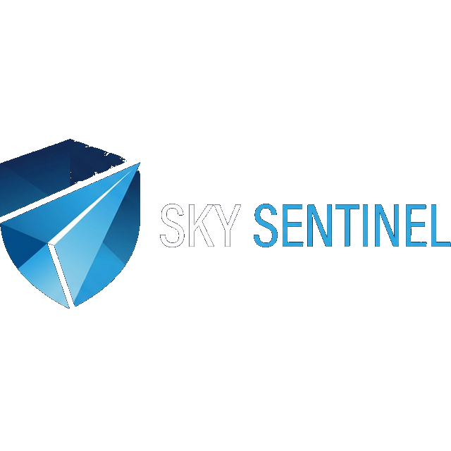
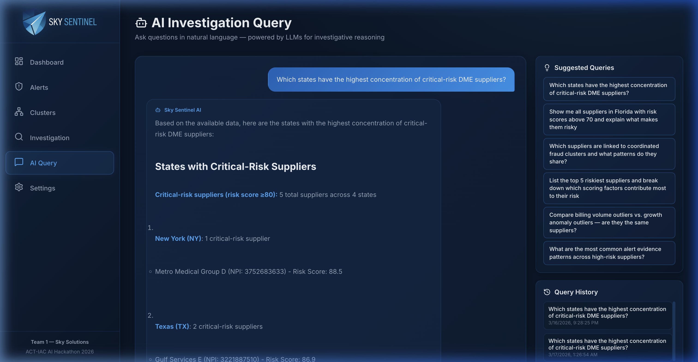

<!--
Sky Sentinel — AI-Augmented DME Fraud Detection Platform
Team 1 · Sky Solutions · ACT-IAC AI Hackathon 2026

Project type: Full-stack AI/ML application (React 19 + FastAPI + scikit-learn + LLM)
Domain: CMS Medicare Program Integrity — Durable Medical Equipment fraud detection
AI/ML stack: Ensemble anomaly detection (Isolation Forest, Z-Score analysis, DBSCAN clustering)
  + two-stage LLM pipeline (batch classification + interactive reasoning via ChatGPT 5.4 Mini)
Key differentiator: Cross-supplier behavioral clustering detects coordinated fraud networks
  that are invisible to traditional single-supplier analysis
Responsible AI: Explainable AI narratives, 6-factor decomposable risk scores,
  geographic fairness monitoring, human-in-the-loop controls, no automated enforcement
Data: Live CMS Medicare Supplier API (real NPIs) + synthetic fraud modeled on
  Operation Gold Rush ($10.6B DOJ case, June 2025)
Deployment: Docker single-container, vendor-agnostic LLM, SQLite→PostgreSQL path
Status: Working end-to-end prototype with 8 pages, 25+ REST endpoints, 1500+ line docs
-->
<p align="center">
  
</p>

<h1 align="center">Sky Sentinel</h1>

<p align="center">
  <strong>AI-Augmented DME Fraud Detection — Human-in-the-Loop Pattern Modeling for Medicare Program Integrity</strong>
</p>

<p align="center">
  <em>ACT-IAC AI Hackathon: AI in Action — Team 1 · Sky Solutions</em><br>
  <em>March 27, 2026 · Carahsoft Conference Center, Reston VA</em>
</p>

<p align="center">
  
  
  
  
  
  
</p>

---

## At a Glance

| Capability Area | Priority | Sky Sentinel Response |
|---|---|---|
| **Mission Relevance** | 🔴 High | Targets CMS's #1 program integrity gap — coordinated DME fraud networks that evade single-supplier detection. Uses **real CMS Medicare API data**. Synthetic fraud modeled on **Operation Gold Rush** ($10.6B DOJ case). |
| **Technical Soundness** | 🔴 High | **3-algorithm ML ensemble** (Isolation Forest + Z-Score + DBSCAN) + **two-stage LLM pipeline** + live CMS data integration. **Working end-to-end prototype** — not slides. Full data pipeline: CMS API ingestion → feature engineering → anomaly detection → LLM reasoning → composite scoring → investigator review. |
| **Explainability & Responsible AI** | 🔴 High | Every alert includes a **plain-English AI-generated narrative** explaining *why*. **6-factor decomposable** risk scores — no black boxes. **No automated enforcement** — human investigators make all decisions. **Geographic fairness monitoring** for algorithmic bias. Full **audit trail** with timestamps. |
| **Feasibility for Adoption** | 🔴 High | **Docker single-command deploy**. Real CMS API data (not toy data). SQLite→PostgreSQL migration path. **Vendor-agnostic LLM** architecture (OpenAI/Anthropic/Local/Mock). JWT + RBAC with 3 roles. **4-phase pilot roadmap** from MVP → CMS Pilot → Production → Enterprise. |
| **Innovation** | 🟡 Medium | **First-of-kind combination:** ensemble AI + cross-supplier DBSCAN clustering + two-stage LLM pipeline for Medicare fraud. Detects coordinated networks **invisible to traditional single-supplier analysis**. Natural language investigation. Multi-agent AI development methodology. |
| **Demo Clarity** | 🟡 Medium | **4-act narrative arc:** Dashboard overview → Individual bad actor → Hidden fraud network → Investigator in control. **Live animated recordings** embedded. 5-minute demo script with time allocations. |

### 💡 Innovation Highlights

> What makes Sky Sentinel fundamentally different from existing fraud detection systems:

1. **Ensemble AI + Cross-Supplier Clustering** — First known combination of Isolation Forest + Z-Score + DBSCAN for Medicare DME fraud, detecting coordinated networks that are invisible to single-supplier analysis systems
2. **Two-Stage LLM Pipeline** — Encoder-proxy classification for batch scoring + decoder reasoning for human-readable investigative narratives (following IBM watsonx architecture patterns)
3. **Human-in-the-Loop Pattern Modeling** — Investigators don't just review AI outputs — they shape detection by defining custom patterns, tuning 6-dimension weights, and testing hypotheses against live data
4. **Real-World Data Foundation** — Built on live CMS Medicare API data with synthetic fraud scenarios modeled on the largest DOJ healthcare fraud case ever charged ($10.6B Operation Gold Rush)
5. **AI-Powered Development** — Built using multi-agent AI development (Opus 4.6 + Codex 5.4 + Gemini 3.1 Pro) inside Google Antigravity IDE — the same "AI amplifies humans" philosophy applied to building the product itself

---

## Table of Contents

- [At a Glance](#at-a-glance)
- [Executive Summary](#executive-summary)
- [The Problem We Solve](#the-problem-we-solve)
- [Why Sky Sentinel Goes Beyond Traditional Detection](#why-sky-sentinel-goes-beyond-traditional-detection)
- [Application Pages](#application-pages)
  - [Dashboard — Command Center](#-dashboard--command-center)
  - [Alert Rankings — Prioritized Risk Queue](#-alert-rankings--prioritized-risk-queue)
  - [Supplier Drill-Down — Investigator Deep Dive](#-supplier-drill-down--investigator-deep-dive)
  - [Cluster Detection — Coordinated Fraud Networks](#-cluster-detection--coordinated-fraud-networks)
  - [Investigation Controls — Human-in-the-Loop](#-investigation-controls--human-in-the-loop-pattern-modeling)
  - [AI Query — Natural Language Investigation](#-ai-query--natural-language-investigation)
  - [Settings — Model Configuration](#-settings--llm-configuration)
- [How the AI/ML Pipeline Works](#how-the-aiml-pipeline-works)
  - [End-to-End Data Pipeline](#end-to-end-data-pipeline)
  - [Layer 1: Statistical Anomaly Detection](#layer-1-statistical-anomaly-detection-find-the-outliers)
  - [Layer 2: Behavioral Clustering](#layer-2-behavioral-clustering-find-the-networks)
  - [Layer 3: LLM Contextual Intelligence](#layer-3-llm-contextual-intelligence-explain-the-why)
  - [Composite Risk Scoring](#composite-risk-scoring)
- [Multi-Model LLM Routing](#multi-model-llm-routing)
- [Architecture](#architecture)
- [Data Sources & Rationale](#data-sources--rationale)
- [API Reference](#api-reference)
- [Responsible AI & Fairness](#responsible-ai--fairness)
- [AI Governance & Auditability](#ai-governance--auditability)
- [Demo Walkthrough](#demo-walkthrough-5-minutes)
- [Demo Recordings](#demo-recordings)
- [Quick Start](#quick-start)
- [Technology Stack](#technology-stack)
- [Capability Matrix](#capability-matrix)
- [Government Deployment Readiness](#government-deployment-readiness)
- [Path to CMS Pilot](#path-to-cms-pilot)
- [Future Roadmap](#future-roadmap)
- [How We Built This: AI-Powered Development](#how-we-built-this-ai-powered-development)
- [Team](#team)
- [Repository Structure](#repository-structure)
- [Acknowledgments](#acknowledgments)

---

<!-- Section: Executive Summary — Mission relevance, problem definition, solution overview -->
## Executive Summary

**Sky Sentinel** is an AI-powered investigation platform that helps Medicare program integrity analysts detect Durable Medical Equipment (DME) fraud that traditional detection systems miss.

Medicare fraud, waste, and abuse cost the U.S. government an estimated **$60+ billion annually**. DME is one of the most exploited categories — high-value items like power wheelchairs ($30,000+), oxygen equipment, and orthotics are easy to fabricate claims for and difficult to verify. Fraudulent DME suppliers operate as shell companies, bill aggressively through coordinated networks, and dissolve before detection.

**The core problem:** Traditional rule-based and single-model ML detection systems analyze each supplier in isolation. Modern fraud schemes are designed to evade these systems by **fragmenting suspicious activity across multiple entities**, keeping each individual supplier just below detection thresholds.

> **Industry validation:** IBM's Fraud and Abuse Management System (FAMS), deployed across state Medicaid programs and federal agencies, uses the same ensemble AI philosophy — combining multiple ML models with entity analysis to achieve detection rates up to 10× higher than rule-based systems. Sky Sentinel independently arrived at this same architecture, optimized for CMS Medicare DME oversight.

Sky Sentinel addresses this gap by combining three detection layers that no traditional system offers together:

| Sky Sentinel Capability | What It Detects | Traditional Systems |
|---|---|---|
| **Ensemble AI Detection** | Individual suppliers with billing volumes, growth rates, or HCPCS mixes that deviate from peer baselines — detected by three complementary ML algorithms working together | ❌ Typically rely on a single model or threshold |
| **DBSCAN Cross-NPI Clustering** | Coordinated groups of suppliers that individually look normal but collectively show synchronized suspicious patterns | ❌ No cross-entity analysis |
| **Two-Stage LLM Pipeline** | Encoder-style classification for rapid scoring + decoder LLM (ChatGPT 5.4 Mini) for human-readable narrative explanations of *why* patterns are suspicious | ❌ Cannot interpret clinical or investigative context |
| **Human-in-the-Loop Controls** | Investigator-driven hypothesis testing, tunable sensitivity, pattern creation | ❌ Static rules require developer updates |
| **Algorithmic Fairness Monitoring** | Geographic bias detection — ensures alerts aren't disproportionately concentrated in specific regions | ❌ No bias monitoring |

Most importantly, Sky Sentinel keeps **investigators in control**. The platform doesn't auto-block or auto-approve — it surfaces suspicious patterns with transparent evidence, then gives analysts the tools to define their own detection criteria, test hypotheses, and make the final call.

> **Sky Sentinel moves program integrity from reactive review to proactive prevention — where AI amplifies human expertise, not replaces it.**

---

<!-- Section: Problem Statement — Real-world government problem, DME fraud challenges, detection gaps -->
## The Problem We Solve

### Why DME Fraud Is Hard to Catch

| Challenge | Description |
|---|---|
| **High-value, easy to fabricate** | DME items like power wheelchairs (HCPCS K0856, ~$30,000) are lucrative targets with documentation that's easy to forge |
| **Shell company exploitation** | Fraudulent suppliers incorporate, bill aggressively for months, then dissolve before review catches up |
| **Coordinated networks** | Criminal organizations operate dozens of DME companies, use nominee owners, and distribute billing across entities to stay under individual thresholds |
| **Telemedicine pipeline** | Cold-call marketers solicit seniors for "free" equipment, then bill Medicare using fraudulent telehealth prescriptions |
| **Templated documentation** | Fraud rings use shared medical necessity templates across multiple NPIs, creating textual patterns invisible to structured data systems |

### What Traditional Detection Misses

Traditional ML-based detection systems (logistic regression, random forest, rule-based thresholds) have fundamental limitations:

- ❌ **Single-supplier focus** — Analyze each provider in isolation; can't detect coordinated multi-NPI schemes
- ❌ **Structured data only** — Process billing codes and dollar amounts but can't read claim narratives or medical necessity justifications
- ❌ **Black-box scores** — Produce numeric flags without explainable reasoning for investigators
- ❌ **Static rules** — Can't adapt to evolving fraud tactics without manual reprogramming
- ❌ **High false positive rates** — Without clinical context, legitimate high-cost providers get flagged alongside real bad actors

**Sky Sentinel fills these exact gaps.**

---

<!-- Section: Technical Innovation — Ensemble AI, two-stage LLM, human-in-the-loop, real data, fairness -->
## Why Sky Sentinel Goes Beyond Traditional Detection

### 1. Ensemble AI — Multi-Model Detection

Traditional systems typically rely on a **single ML algorithm** (e.g., logistic regression or random forest). Sky Sentinel uses an **ensemble of complementary detection methods** — the same architectural philosophy used by IBM's enterprise fraud detection systems (FAMS) and recommended by NIST for high-stakes decision support:

| Method | What It Is (Plain English) | What It Catches |
|---|---|---|
| **Isolation Forest** | An algorithm that isolates outliers by randomly partitioning data — the easier a data point is to isolate, the more anomalous it is. Unlike threshold-based rules, it detects *combinations* of unusual features that wouldn't individually trigger an alert. | Suppliers with unusual *combinations* of high billing + narrow HCPCS mix + new enrollment date — patterns invisible to single-variable thresholds |
| **Z-Score Analysis** | A statistical measure showing how many standard deviations a supplier's metrics fall from its peer group average. A Z-score of +2.5 means the supplier is 2.5 standard deviations above its peers — highly unusual. | Suppliers whose billing volume, growth rate, or geographic spread significantly deviates from what's normal for their specialty and region |
| **DBSCAN Clustering** | Density-Based Spatial Clustering of Applications with Noise — an algorithm that groups nearby data points in feature space without needing to pre-specify how many groups exist. It naturally discovers clusters of *any shape* and marks lone points as noise. | Groups of suppliers that individually look normal but *collectively* show coordinated billing patterns — synchronized growth, shared HCPCS codes, overlapping territories — classic indicators of organized fraud rings |

> **Why an ensemble?** No single algorithm catches everything. Isolation Forest detects individual outliers that Z-scores might miss due to skewed distributions. Z-scores catch peer-relative deviations that Isolation Forest might miss in dense clusters. DBSCAN catches coordinated fraud networks that *neither* individual method can detect, because no single supplier exceeds any threshold. Running all three in parallel and combining their outputs is what makes this an **ensemble** — the collective result is more accurate than any individual model.

### 2. Two-Stage LLM Pipeline (Encoder → Decoder)

Following the same architecture used by IBM's watsonx fraud detection, Sky Sentinel separates LLM usage into two distinct stages:

| Stage | Model Type | Role | Speed | Cost |
|---|---|---|---|---|
| **Stage 1: Classification** | Encoder-style (batch tier) | Rapid scoring, pattern classification, structured risk assessment during data ingestion | Fast | Low |
| **Stage 2: Reasoning** | Decoder (interactive tier) | Human-readable narrative explanations, investigator Q&A, contextual analysis | Deliberate | Medium |

> **Hackathon note:** In this MVP, both tiers use **ChatGPT 5.4 Mini** for simplicity. The architecture is designed so the batch tier can be swapped for purpose-built encoder models (BERT/RoBERTa) in production — no code changes needed, just update `.env`.

> **Why two stages?** In production, Stage 1 would use purpose-built encoder models (BERT/RoBERTa) for sub-millisecond classification. In this demo, we use ChatGPT 5.4 Mini as a lightweight classification proxy. The key architectural insight — borrowed from IBM's ensemble approach — is that **you don't need expensive reasoning for every operation**, only for the cases that require human-readable explanation.

**Example Stage 2 output (decoder reasoning):**
> *"DME Supplier NPI-3752683633 (Metro Medical Group D) — 50% of sampled claims involve ultra-high-cost power wheelchair accessories (K0871: $23,687, K0856: $27,020) totaling $50,707 in just two claims. Enrolled only 4-5 months ago, yet immediately billing for complex, high-reimbursement DME categories. This concentration is highly unusual for a newly enrolled supplier and represents classic fraud indicators."*

This narrative identifies **specific HCPCS codes and dollar amounts**, connects them to **enrollment timing**, and explains the **fraud pattern** — something no traditional ML score can do.

### 3. Human-in-the-Loop Investigation

Investigators don't just review alerts — they **shape the detection**:
- Adjust anomaly sensitivity across 6 scoring dimensions with interactive sliders, plus a risk threshold cutoff
- Define custom detection patterns ("show me new FL suppliers billing >2x peer average for power wheelchairs")
- Test pattern hypotheses against the live dataset before committing changes
- All decisions are logged with timestamps for audit compliance

### 4. Real CMS Data Integration

Sky Sentinel ingests **live data from the CMS Medicare Supplier API** — real NPIs, real geographies, real billing volumes — combined with synthetic fraud scenarios. This isn't a toy demo with fake data; it's production-adjacent intelligence built on actual Medicare provider records.

In production, Sky Sentinel would integrate additional CMS and public data sources identified in our architecture design:

| Data Source | Purpose |
|---|---|
| **CMS DME Supplier Utilization API** | Real NPIs, billing volumes, HCPCS codes, geographic data (currently integrated) |
| **DMEPOS Fee Schedule** | Validates billed amounts against CMS-allowed reimbursement rates |
| **Local/National Coverage Determinations (LCDs/NCDs)** | LLM cross-references claim documentation against coverage policy requirements |
| **OIG Exclusion List (LEIE)** | Screens suppliers and referring physicians against excluded individuals/entities |
| **Medicare Provider Enrollment Data (PECOS)** | Validates enrollment status, incorporation dates, and ownership history |
| **Beneficiary Claims History** | Cross-references DME orders against beneficiary diagnosis and utilization patterns |
| **DOJ/OIG Enforcement Actions** | Informs synthetic fraud scenario design and emerging scheme detection |

### 5. Algorithmic Fairness Monitoring

A dedicated Fairness & Bias Review panel on the dashboard monitors alert distributions across geographies, ensuring the system isn't disproportionately flagging suppliers in specific regions without justification.

---

## Application Pages

Sky Sentinel consists of eight interconnected pages, each designed for a specific phase of the investigation workflow.

### 📊 Dashboard — Command Center

<p align="center">
  
</p>

<details>
<summary>🎬 <strong>Dashboard Walkthrough (click to expand)</strong></summary>
<br>
<p align="center">
  
</p>
</details>

The Dashboard provides a real-time operational overview of the entire monitored supplier population.

| Component | Purpose |
|---|---|
| **Metric Cards** | At-a-glance counts: Total Alerts, Critical Risk, Active Clusters, Claims Processed, Suppliers Monitored |
| **AI Approach Banner** | Explains why Sky Sentinel goes beyond traditional fraud detection — Ensemble AI, LLM Reasoning (encoder + decoder), Human-in-the-Loop, Fairness Built-In — with custom icons for each pillar |
| **Provider Risk Heatmap** | Interactive US choropleth map showing geographic risk concentration by state, using graduated colors (green → yellow → red) |
| **Fairness & Bias Review** | Monitors alert distribution across geographies to ensure no algorithmic bias in risk flagging |
| **Claims Trend Chart** | Time-series area chart showing total vs. flagged claims over 12 months |
| **Risk Distribution** | Donut chart of alert severity breakdown: Critical, High, Medium |
| **Top DME Categories** | Horizontal bar chart of HCPCS codes by total billed amount |
| **Live Claims Feed** | Real-time streaming view of incoming claims with color-coded status badges |
| **Top Risk Alerts** | Quick-access list of the highest-scoring supplier alerts |
| **Geographic Risk Bar Chart** | State-level bar chart with average risk scores and alert counts |

---

### 🚨 Alert Rankings — Prioritized Risk Queue

<p align="center">
  
</p>

The Alert Rankings page is the analyst's primary work queue — a ranked list of every flagged supplier sorted by composite AI risk score (0–100).

| Feature | Detail |
|---|---|
| **Ranked Alert Cards** | Risk score badge (color-coded), supplier name & NPI, one-line risk summary, evidence tags showing top anomaly drivers |
| **Diversified Evidence Tags** | Each supplier has unique, AI-derived evidence: "Explosive claims growth: 100th percentile vs. peer group", "High-cost HCPCS concentration", "AI detected templated documentation", "Geographic impossibility indicator", "Linked to coordinated supplier network" |
| **Risk Level Filters** | Filter by Critical / High / Medium |
| **State Filters** | Geographic filtering for region-specific investigations |

**Investigation workflow:** An analyst starts each session here, scans the top alerts, and clicks into any supplier for a full deep dive. The diversified evidence tags give enough context for rapid triage.

---

### 🔍 Supplier Drill-Down — Investigator Deep Dive

<p align="center">
  
</p>

<details>
<summary>🎬 <strong>Alert → Drill-Down Investigation Flow (click to expand)</strong></summary>
<br>
<p align="center">
  
</p>
</details>

The most detailed view in the system — a complete investigation dossier for a single supplier.

| Section | What It Shows |
|---|---|
| **Provider Profile** | NPI, organization name, city/state, entity type, enrollment date |
| **Composite Risk Score Gauge** | Animated SVG semicircle gauge (0–100) with color graduation |
| **Risk Factor Breakdown** | Horizontal bar chart decomposing the score into 6 weighted dimensions (see [Composite Risk Scoring](#composite-risk-scoring)) |
| **Billing Timeline** | Line chart showing **4 quarters** (2024-Q2 through 2025-Q1) of claims volume and billing amounts — reveals ramp-up patterns and seasonal anomalies |
| **AI Risk Assessment** | Full LLM-generated narrative analysis with KEY CONCERNS, EVIDENCE SUMMARY, and RECOMMENDED ACTIONS (see below) |
| **Investigator Actions** | Three buttons: **Escalate** (formal investigation), **Monitor** (watchlist), **Dismiss** (false positive) — all logged with timestamps. **Admin and Investigator only** — hidden for Viewer role |
| **Recent Claims Table** | Paginated table of individual claims with HCPCS codes, billing amounts, dates, and status |

#### AI Risk Assessment (LLM-Generated Narrative)

<p align="center">
  
</p>

This is **Sky Sentinel's marquee feature** — a full investigative narrative written by AI, analyzing the supplier's data and explaining *why* the patterns are concerning in plain English:

> **Key Concerns Identified:**
> 1. **Extreme High-Cost Equipment Concentration** — 50% of claims involve ultra-high-cost power wheelchair accessories (K0871: $23,687, K0856: $27,020) totaling $50,707 in just two claims
> 2. **New Supplier with Sophisticated Billing** — Enrolled only 4–5 months ago but immediately billing for complex, high-reimbursement DME categories
> 3. **Cluster Association** — Linked to a coordinated network of suppliers with synchronized billing patterns
> 4. **Recommended Action** — Immediate further review warranted; consider coordinated review with related NPIs

---

### 🕸️ Cluster Detection — Coordinated Fraud Networks

<p align="center">
  
</p>

<details>
<summary>🎬 <strong>Cluster Network Exploration (click to expand)</strong></summary>
<br>
<p align="center">
  
</p>
</details>

Reveals what traditional detection completely misses: **behaviorally similar supplier groups** that collectively exhibit fraud patterns even though no individual member triggers an alert alone.

| Feature | Detail |
|---|---|
| **Cluster Cards** | Member count, collective risk score, shared attributes, geographic footprint |
| **Network Graph** | Interactive SVG network visualization with adaptive concentric ring layouts for large clusters — all members visible without overlap |
| **Shared Attributes Panel** | Behavioral similarities: overlapping HCPCS categories, synchronized growth, geographic clustering, similar incorporation timelines |
| **LLM Cluster Narrative** | AI-generated explanation of why the group appears coordinated and what investigation angles to pursue |
| **Member Drill-Down** | Click any cluster member to navigate to their individual Supplier Detail view |

**6 Pre-Assigned Fraud Rings (Operation Gold Rush):** Each cluster has a minimum of 5 members and is modeled on the real $10.6B DOJ case:

| Cluster | Location | Members | Gold Rush Parallel |
|---|---|---|---|
| **Metro** | Brooklyn, NY | 8 | TCO hub — nominee-owned shells with nationwide reach |
| **SunCoast** | Miami, FL | 6 | Southern distribution pipeline |
| **Gulf** | Houston, TX | 5 | Oil corridor front companies |
| **Pacific** | Los Angeles, CA | 5 | West Coast high-cost wheelchair ring |
| **Atlantic** | Newark, NJ | 5 | Mid-Atlantic corridor bridge network |
| **Heartland** | Chicago, IL | 5 | Midwest ghost operations |

**The demo story:** Show a cluster where no single supplier individually exceeds traditional thresholds — but together, they reveal a coordinated billing operation. This is the scenario that traditional detection systems fundamentally cannot catch.

---

### ⚙️ Investigation Controls — Human-in-the-Loop Pattern Modeling

<p align="center">
  
</p>

Where Sky Sentinel's **Human-in-the-Loop philosophy** comes to life. Investigators actively shape the detection model.

| Control | Function |
|---|---|
| **6-Dimension Threshold Sliders + Risk Cutoff** | Adjustable sensitivity for: Billing Volume vs. Peers, Growth Rate, HCPCS Concentration, Geographic Spread, LLM Contextual Weight, Cluster Association — plus a risk threshold cutoff. Each slider updates the alert population in real-time |
| **Saved Weight Configurations** | Save, load, rename, and delete named weight configurations (e.g., "Shell Company Focus", "Geographic Targeting") for rapid hypothesis switching |
| **Pattern Builder** | Define custom detection patterns in natural language: "Show me DME suppliers in Florida incorporated in the last 12 months billing more than 2x peer average for power wheelchairs" |
| **Hypothesis Tester** | Test pattern definitions against the live dataset to preview results before committing |
| **Saved Patterns** | Store and retrieve investigator-defined patterns for reuse and team sharing |

---

### 🤖 AI Query — Natural Language Investigation

<p align="center">
  
</p>

<details>
<summary>🎬 <strong>Live AI Query Result (click to expand)</strong></summary>
<br>
<p align="center">
  
</p>
</details>

A **conversational investigation interface** where analysts ask questions in plain English.

| Feature | Detail |
|---|---|
| **Natural Language Input** | Free-text query box for investigative questions |
| **Enriched Data Context** | The LLM receives: scoring factor breakdowns (all 6 dimensions), cluster membership, alert evidence/top_reasons, and state-level risk summary — enabling data-driven answers |
| **Suggested Queries** | Pre-built queries aligned with available data (e.g., "Which states have the highest concentration of critical-risk DME suppliers?", "List the top 5 riskiest suppliers and break down which scoring factors contribute most") |
| **Query History** | Sidebar of previous queries for reference and follow-up |

**Example AI response:**
> *"Based on the fraud investigation data, Texas (TX) leads with 2 critical-risk suppliers out of 5 total nationwide. Metro Medical Group D in New York holds the highest individual risk score at 88.5. The critical-risk suppliers are characterized by explosive claims growth (100th percentile), high-cost HCPCS concentration, and several are linked to coordinated supplier networks (clusters)."*

---

### ⚙️ Settings — LLM Configuration

<p align="center">
  
</p>

Configurable model selection with support for multiple providers:

| Provider | Available Models |
|---|---|
| **OpenAI** *(default)* | ChatGPT 5.4 Mini, ChatGPT 5.4 Nano, GPT-4.1, GPT-4.1 Mini, GPT-4.1 Nano, o3, o4-mini, GPT-4o, GPT-4o Mini |
| **Anthropic** | Claude Sonnet 4, Claude Opus 4, Claude 3.7 Sonnet, Claude 3.5 Sonnet, Claude 3.5 Haiku |
| **Local (Ollama)** | Llama 3, Mistral, DeepSeek R1, Qwen 2.5, Phi-4, Gemma 3 |
| **Mock (Demo)** | Pre-generated narratives for offline/demo use |

The architecture supports swappable LLM providers via an abstract `BaseLLMProvider` interface — additional providers can be added without code changes. API keys are stored per-provider in browser localStorage and sent via request headers — never logged on the server.

---

## Authentication & Role-Based Access Control

Sky Sentinel uses **JWT-based authentication** with three pre-configured roles:

| Role | Dashboard | Alerts | Clusters | AI Query | Investigation Controls | Investigator Actions | Settings |
|---|---|---|---|---|---|---|---|
| **Admin** | ✅ | ✅ | ✅ | ✅ | ✅ Full access | ✅ Escalate/Monitor/Dismiss | ✅ LLM config, API keys |
| **Investigator** | ✅ | ✅ | ✅ | ✅ | ✅ Threshold tuning | ✅ Escalate/Monitor/Dismiss | ❌ Hidden |
| **Viewer** | ✅ | ✅ Read-only | ✅ | ❌ Hidden | ❌ Hidden | ❌ Hidden | ❌ Hidden |

**Login Credentials:**

| Email | Password | Role |
|---|---|---|
| `vtanu@skysolutions.com` | `sky123` | Admin — full access |
| `james@skysolutions.com` | `sky123` | Admin — full access |
| `pdeka@skysolutions.com` | `sky123` | Investigator — everything except Settings |
| `rsabbani@skysolutions.com` | `sky123` | Investigator — everything except Settings |
| `kjuvvadi@skysolutions.com` | `sky123` | Viewer — read-only dashboard views |
| `admin` | `sky123` | Admin (generic demo fallback) |

The login page accepts email addresses for team members, or "admin" for the generic fallback.

**"View As" Role Impersonation (Admin only):**
Admins see a "View As" switcher in the sidebar that instantly previews the app as an Investigator or Viewer — navigation items, page access, and UI elements update in real-time without logging out. Click "Back to Admin" to return.

---

<!-- Section: AI/ML Pipeline — Technical soundness, data pipeline (ingestion→processing→output), architecture -->
## How the AI/ML Pipeline Works

Sky Sentinel's detection engine uses a **three-layer pipeline** that produces a composite risk score for every monitored supplier. This section explains each layer in detail so any reviewer can understand how the system works.

### End-to-End Data Pipeline

> **Data flow from ingestion to investigator action:**

```
┌─────────────────────────────────────────────────────────────────────────┐
│                        DATA INGESTION                                   │
│  CMS Medicare API (300+ real suppliers) + Synthetic Fraud Scenarios      │
│  cms_client.py → seed_data.py                                           │
└──────────────────────────────┬──────────────────────────────────────────┘
                               │
┌──────────────────────────────▼──────────────────────────────────────────┐
│                     FEATURE ENGINEERING                                  │
│  7 behavioral metrics: total_billed, claim_count, beneficiary_count,     │
│  unique_hcpcs, avg_billed_per_claim, qoq_growth_rate, geo_spread        │
└──────────────────────────────┬──────────────────────────────────────────┘
                               │
         ┌─────────────────────┼─────────────────────┐
         ▼                     ▼                     ▼
┌────────────────┐  ┌──────────────────┐  ┌──────────────────┐
│   LAYER 1      │  │     LAYER 2      │  │     LAYER 3      │
│   Statistical  │  │   Behavioral     │  │   LLM Contextual │
│   Detection    │  │   Clustering     │  │   Intelligence   │
│                │  │                  │  │                  │
│ Isolation      │  │ Pre-assigned     │  │ ChatGPT 5.4 Mini │
│ Forest +       │  │ Gold Rush +      │  │ Narrative        │
│ Z-Score +      │  │ DBSCAN           │  │ Analysis         │
│ Time-Series    │  │ Discovery        │  │                  │
└───────┬────────┘  └────────┬─────────┘  └────────┬─────────┘
        └───────────────────┬┘                     │
                            ▼                      │
┌───────────────────────────────────────────────────▼─────────────────────┐
│                    COMPOSITE RISK SCORING                                │
│  6 weighted factors → single 0-100 score (adjustable by investigators)  │
└──────────────────────────────┬──────────────────────────────────────────┘
                               │
┌──────────────────────────────▼──────────────────────────────────────────┐
│                      ALERT GENERATION                                    │
│  Ranked alerts with AI narratives, evidence tags, cluster associations   │
└──────────────────────────────┬──────────────────────────────────────────┘
                               │
┌──────────────────────────────▼──────────────────────────────────────────┐
│                   INVESTIGATOR REVIEW                                    │
│  Human-in-the-Loop: Escalate / Monitor / Dismiss (logged + auditable)   │
└──────────────────────────────┬──────────────────────────────────────────┘
                               │
┌──────────────────────────────▼──────────────────────────────────────────┐
│                     FEEDBACK LOOP                                        │
│  Decision logging → baseline recalibration → model retraining (Phase 3) │
└─────────────────────────────────────────────────────────────────────────┘
```

> **Key insight:** Data flows from CMS API ingestion through three parallel detection layers, merges into a transparent composite score, and terminates at a human investigator — never at an automated enforcement action.

### Layer 1: Statistical Anomaly Detection (Find the Outliers)

**Goal:** Identify individual suppliers whose billing behavior deviates significantly from their peers.

#### Isolation Forest

**What it is:** An unsupervised machine learning algorithm designed specifically for anomaly detection. Unlike supervised models that need labeled "fraud" / "not fraud" training data (which is expensive and biased), Isolation Forest works by learning what normal looks like and flagging everything that doesn't fit.

**How it works:** The algorithm randomly selects a feature (e.g., billing volume) and a random split value, then partitions the data. Anomalous data points — those that are very different from the majority — get isolated in fewer splits. The number of splits needed to isolate a point becomes its anomaly score.

**Implementation:**
```python
IsolationForest(n_estimators=100, contamination=0.10, random_state=42)
```
- **100 estimators** (trees) — each builds a different random partition
- **10% contamination** — the model expects roughly 10% of suppliers to be anomalous
- **7-feature matrix:** total billed, claim count, beneficiary count, unique HCPCS count, average billed per claim, quarter-over-quarter growth rate, geographic spread

**Why this matters:** Isolation Forest catches suppliers with unusual *combinations* of features. A single high billing amount might be legitimate for a specialized supplier; but high billing + narrow HCPCS mix + new enrollment + wide geographic spread together is highly suspicious — and this algorithm detects that multi-dimensional pattern automatically.

#### Z-Score Peer Deviation

**What it is:** A statistical measure showing how many standard deviations a value falls from the mean of its peer group. A Z-score of 0 means perfectly average; +2.0 means 2 standard deviations above the mean (top ~2.5%).

**How it works:** Sky Sentinel groups suppliers by state (geographic peer group), then computes the mean and standard deviation for key metrics within each group. Each supplier's metrics are then compared to their peer group statistics.

**Why it complements Isolation Forest:** Z-scores are peer-relative — they catch a Florida supplier billing 3x the Florida average even if their absolute numbers are similar to New York suppliers. Isolation Forest operates on absolute features and might miss this peer-relative deviation.

#### Time-Series Detection

**What it is:** Quarter-over-quarter growth rate analysis that identifies sudden billing spikes or ramp-up patterns consistent with fraud schemes.

**Why it matters:** Many fraud schemes follow a predictable pattern: incorporate → enroll → ramp billing aggressively → dissolve. Time-series detection catches the "ramp" phase before the supplier disappears.

---

### Layer 2: Behavioral Clustering (Find the Networks)

**What it is:** DBSCAN (Density-Based Spatial Clustering of Applications with Noise) is a clustering algorithm that groups data points based on density. Unlike K-Means (which requires specifying the number of clusters in advance), DBSCAN automatically discovers clusters of any shape and any quantity, and marks isolated points as noise.

**How it works in Sky Sentinel:**

Sky Sentinel uses a **dual-layer cluster strategy**:

1. **Pre-assigned Gold Rush clusters** — 6 coordinated fraud rings (34 suppliers, 5–8 members each) are seeded with pre-assigned cluster membership, modeled directly on Operation Gold Rush's transnational shell company network. These persist regardless of data variation.

2. **DBSCAN discovery** — Additional clusters among the remaining supplier population are discovered automatically:
```python
DBSCAN(eps=0.9, min_samples=3)  # post-filter: keep only 5-50 members
```
- **eps=0.9** — two suppliers are considered "neighbors" if their standardized feature distance is less than 0.9 standard deviations
- **min_samples=3** — a core point needs at least 3 neighbors
- **Post-filter** — only clusters with 5–50 members are retained (under 5 is too small to indicate coordination; over 50 is the legitimate baseline population)

The algorithm operates on standardized behavioral features: billing volume, growth rate, HCPCS mix, geographic footprint, and enrollment timing. Suppliers that are close together in this multi-dimensional feature space get grouped into clusters.

**What this catches:** Coordinated fraud networks — groups of suppliers that individually look normal (each below detection thresholds) but collectively show synchronized billing patterns, overlapping product codes, and shared geographic territories. This is the pattern behind the largest healthcare fraud cases historically, where criminal organizations operate dozens of DME companies simultaneously.

---

### Layer 3: LLM Contextual Intelligence (Explain the "Why")

**What it is:** Large Language Model (LLM) integration that analyzes each high-risk supplier's complete data profile and generates human-readable investigative narratives.

**Four LLM functions:**

| Function | Purpose | When It Runs |
|---|---|---|
| `analyze_supplier()` | Generates narrative risk assessment for a supplier with KEY CONCERNS, EVIDENCE SUMMARY, and RECOMMENDED ACTIONS | At seed time for all high-risk suppliers |
| `analyze_cluster()` | Explains why a group of suppliers appears coordinated | On-demand when viewing cluster detail |
| `process_query()` | Answers investigator questions using enriched data context | Real-time on the AI Query page |
| `detect_text_similarity()` | Compares medical necessity narratives across claims to detect templated language | Available for documentation review |

**Why LLMs matter here:** Traditional ML can flag *that* something is anomalous. An LLM can explain *why* — connecting specific HCPCS codes to dollar amounts, enrollment timing to billing velocity, and geographic patterns to known fraud hotspots. This transforms a numeric score into an actionable investigation brief.

---

### Composite Risk Scoring

The final risk score (0–100) combines all three layers with transparent, adjustable weights:

| Factor | Weight | Source | What It Measures |
|---|---|---|---|
| **Billing Volume vs. Peers** | 20% | Isolation Forest + Z-Score | How much a supplier bills compared to its geographic peer group |
| **Growth Rate Anomaly** | 20% | Time-series analysis | Quarter-over-quarter billing acceleration; catches ramp-up fraud patterns |
| **HCPCS Mix Deviation** | 15% | Peer comparison | Whether a supplier concentrates on high-cost codes versus diversified billing |
| **Geographic Spread** | 15% | Beneficiary distribution | Whether beneficiaries span an unusually wide area versus local service patterns |
| **LLM Contextual Findings** | 15% | ChatGPT 5.4 Mini AI analysis | AI-assessed severity based on documentation patterns, policy compliance, and narrative coherence |
| **Cluster Association** | 15% | DBSCAN membership | Whether the supplier belongs to a behaviorally similar group suggesting coordination |

> **These weights are adjustable** through the Investigation Controls page, allowing analysts to tune detection sensitivity for different investigation types.

---

## Multi-Model LLM Routing

Sky Sentinel implements **intelligent three-tier model routing** — following the same architectural pattern used by IBM's fraud detection ensemble, where different model types handle different workloads:

| Tier | Model Type | Current Model | Use Case | Rationale |
|---|---|---|---|---|
| **ML Ensemble** | Traditional ML | Isolation Forest, Z-Score, DBSCAN | Anomaly scoring, peer deviation, cluster detection | Sub-second, zero API cost, runs locally |
| **Batch (Encoder Proxy)** | Fast LLM | ChatGPT 5.4 Mini | Seed-time narrative generation (~47 supplier assessments) | Lightweight classification-style analysis; in production, this tier would use encoder-only models (BERT/RoBERTa) for sub-millisecond scoring |
| **Interactive (Decoder)** | Reasoning LLM | ChatGPT 5.4 Mini | AI Query page, cluster analysis, real-time investigation | Premium reasoning for user-facing features where depth, nuance, and natural language explanation matter most |

> **Architecture note:** IBM's watsonx fraud detection uses the same tiered approach — fast predictive ML handles 95% of cases, with expensive LLM reasoning reserved for ambiguous cases that need contextual judgment. Our batch tier serves as the classification stage; our interactive tier serves as the reasoning stage.

**Configuration via `.env`:**
```bash
LLM_MODEL_BATCH=chatgpt-5.4-mini          # Encoder-proxy / classification tier
LLM_MODEL_INTERACTIVE=chatgpt-5.4-mini     # Decoder / reasoning tier
```

**Why this matters:** In the hackathon MVP, both tiers use ChatGPT 5.4 Mini for simplicity. In production, the batch tier would use purpose-built encoder models (BERT/RoBERTa) for sub-millisecond classification at ~$0.08 per run, while the interactive tier would use a premium reasoning model for the depth and nuance that user-facing features demand. The architecture already supports swapping models per tier via `.env` — no code changes required.

The system supports **swappable LLM providers** (OpenAI, Local/Ollama, Mock) configurable through both environment variables and the in-app Settings page, ensuring vendor flexibility for government deployments.

---

## Architecture

```
┌─────────────────────────────────────────────────────────────┐
│                       FRONTEND LAYER                         │
│                       React 19 + Vite                        │
│                                                              │
│  ┌──────────┐ ┌──────────┐ ┌──────────┐ ┌───────────────┐  │
│  │Dashboard │ │ Alerts   │ │Clusters  │ │ Investigation │  │
│  │          │ │ Rankings │ │ Network  │ │ Controls      │  │
│  ├──────────┤ ├──────────┤ ├──────────┤ ├───────────────┤  │
│  │Supplier  │ │ AI Query │ │ Settings │ │               │  │
│  │Detail    │ │Interface │ │          │ │               │  │
│  └────┬─────┘ └────┬─────┘ └────┬─────┘ └──────┬────────┘  │
│       └─────────────┴────────────┴──────────────┘            │
│                         REST API                             │
└─────────────────────────┬───────────────────────────────────┘
                          │
┌─────────────────────────┴───────────────────────────────────┐
│                      BACKEND LAYER                           │
│                   Python 3.11 + FastAPI                       │
│                                                              │
│  ┌──────────────┐  ┌───────────────┐  ┌──────────────────┐  │
│  │ API Routers  │  │  AI/ML Engine │  │  LLM Service     │  │
│  │              │  │               │  │  (Multi-Model)   │  │
│  │ • Dashboard  │  │ • Isolation   │  │                  │  │
│  │ • Suppliers  │  │   Forest      │  │ BATCH TIER:      │  │
│  │ • Alerts     │  │ • Z-Score     │  │ • ChatGPT 5.4 Mini   │  │
│  │ • Clusters   │  │ • DBSCAN      │  │   (seed/batch)   │  │
│  │ • Claims     │  │ • Composite   │  │ INTERACTIVE:     │  │
│  │ • Investig.  │  │   Scoring     │  │ • ChatGPT 5.4 Mini (query)│  │
│  │ • Settings   │  │               │  │ • Mock fallback  │  │
│  └──────┬───────┘  └───────┬───────┘  └────────┬─────────┘  │
│         └──────────────────┴───────────────────┘             │
│                            │                                  │
│  ┌─────────────────────────┴────────────────────────────┐    │
│  │              SQLite Database                          │    │
│  │  Suppliers │ Claims │ Alerts │ Clusters │ Patterns    │    │
│  └──────────────────────────────────────────────────────┘    │
│                            │                                  │
│  ┌─────────────────────────┴────────────────────────────┐    │
│  │           CMS Medicare API (Live Data)                │    │
│  │  data.cms.gov/data-api — DME Supplier Utilization     │    │
│  └──────────────────────────────────────────────────────┘    │
└──────────────────────────────────────────────────────────────┘
```

### Key Design Decisions

| Decision | Rationale |
|---|---|
| **Single SPA** | Consolidated into one unified dashboard for seamless investigator workflow |
| **SQLite over PostgreSQL** | Zero-config portability — anyone can clone and run immediately without database setup. SQLAlchemy ORM provides a clean migration path to PostgreSQL for production |
| **Multi-model LLM routing** | Two-tier architecture (batch + interactive) — both use ChatGPT 5.4 Mini in hackathon MVP; designed to swap batch tier for encoder models (BERT/RoBERTa) in production |
| **Swappable LLM adapter** | Abstract `BaseLLMProvider` interface with `OpenAIProvider`, `AnthropicProvider`, `LocalProvider`, and `MockLLMProvider` fallback — if the API is unavailable during demo, the system gracefully falls back to pre-generated narratives. Additional providers can be plugged in via the same interface |
| **Real CMS data + synthetic fraud** | Real supplier data provides authenticity; synthetic fraud scenarios ensure compelling demo stories |
| **Two-tier model routing** | Optimizes API cost and latency without sacrificing interactive quality |

---

## Data Sources & Rationale

### Why This Data?

Sky Sentinel needed to demonstrate detection against **realistic provider behavior patterns** while operating entirely on public, non-PHI data. Our approach combines real CMS supplier records with synthetic fraud scenarios:

### 1. CMS Medicare DME Supplier Utilization API

| Field | Detail |
|---|---|
| **Source** | `data.cms.gov/data-api/v1/dataset` — the official CMS Open Data portal |
| **Dataset** | Medicare DME Supplier Utilization (Part B), dataset ID `a2d56d3f-3531-4315-9d87-e29986516b41` |
| **Records Pulled** | 300 real DME suppliers across multiple states |
| **Fields Used** | NPI, organization name, city, state, entity type, HCPCS codes billed, claim counts, beneficiary counts, line item billing amounts |

**Why we chose this data:** This is the *same dataset* that CMS Program Integrity teams use to monitor supplier behavior. By pulling real NPIs and real billing volumes, our anomaly detection operates on authentic distributions — peer baselines, geographic norms, and HCPCS mix patterns reflect real-world Medicare billing, not artificial data. This ensures that when we flag a supplier as an outlier, the deviation is meaningful.

**How it's used:** The `cms_client.py` module fetches supplier records via the CMS API at seed time. Each supplier's real NPI, name, state, and billing profile becomes the baseline population against which the anomaly detection algorithms operate.

### 2. Synthetic Fraud Scenarios (Modeled on Operation Gold Rush)

| Type | Count | Purpose |
|---|---|---|
| **Individual suspicion profiles** | 15 suppliers | Shell-company-style entities with differentiated fraud signatures: billing volume spikes, geographic impossibility, new entity ramp-up, HCPCS concentration, templated documentation, and cluster kingpin roles |
| **Coordinated cluster suppliers** | 34 suppliers (6 clusters × 5–8 members) | Modeled on the Operation Gold Rush transnational network — a Brooklyn hub (8), Florida pipeline (6), Texas front companies (5), California ring (5), Mid-Atlantic corridor (5), and Midwest ghost operations (5), each with synchronized enrollment, shared HCPCS focus, coordinated growth, and pre-assigned cluster membership. All clusters have a minimum of 5 members |
| **Claims** | ~5,500+ total | Realistic claim records with actual HCPCS codes (K0856, K0871, E0260, etc.), billing amounts at the top of CMS fee schedule ranges for shell companies, and templated medical necessity documentation mimicking organized fraud |

**Why synthetic fraud:** Real fraud data is classified and protected. We created synthetic fraud profiles based on publicly documented fraud patterns from DOJ enforcement actions — specifically **Operation Gold Rush (June 2025)**, the $10.6 billion DME fraud case where a transnational criminal organization purchased dozens of shell DME companies, stole the identities of over 1 million Americans, and submitted billions in fraudulent Medicare claims. Each synthetic supplier has a differentiated fraud signature so the detection pipeline demonstrates diverse pattern recognition against real-world tactics.

### 3. What We Don't Use

**No Protected Health Information (PHI) or Personally Identifiable Information (PII) is used.** All beneficiary data is synthetic. Real CMS data is limited to publicly available provider-level aggregated statistics published on data.cms.gov.

---

## Real-World Validation: Operation Gold Rush

Sky Sentinel's synthetic fraud scenarios are modeled on **Operation Gold Rush** — the largest healthcare fraud case by dollar amount ever charged by the Department of Justice (June 30, 2025, EDNY).

| Case Detail | Value |
|---|---|
| **Total fraudulent billing** | $10.6 billion in Medicare claims |
| **Defendants** | 11 — transnational criminal organization based in Russia and Eastern Europe |
| **Shell companies** | Dozens of DME companies purchased with nominee foreign national owners |
| **Identity theft** | 1 million+ stolen American identities across all 50 states |
| **Money laundering** | Proceeds funneled to banks in China, Singapore, Pakistan, Israel, Turkey + cryptocurrency |
| **Cyber infrastructure** | Virtual private servers (VPSs) to mask physical locations |

### How Sky Sentinel Detects Each Fraud Pattern

| Gold Rush Fraud Signature | Sky Sentinel Detection Layer | How It Works |
|---|---|---|
| Coordinated shell company network | **DBSCAN Behavioral Clustering** | Groups suppliers with synchronized enrollment, shared HCPCS codes, and correlated growth — even when no individual supplier triggers a threshold |
| Geographic impossibility (Brooklyn → all 50 states) | **Geographic Spread Scoring** | Flags suppliers whose beneficiary distributions span impossibly wide areas relative to their physical location |
| Post-acquisition billing ramp-up | **Growth Rate Anomaly + Time-Series** | Detects explosive quarter-over-quarter billing acceleration consistent with shell company weaponization |
| Identity theft-scale claim volume | **Billing Volume vs. Peers (Isolation Forest + Z-Score)** | Catches suppliers whose billing volumes are extreme statistical outliers relative to geographic peer groups |
| High-cost DME concentration | **HCPCS Mix Deviation** | Identifies suppliers billing disproportionately on premium codes like power wheelchairs ($30,000+) |
| Templated medical necessity documentation | **LLM Contextual Intelligence** | AI text analysis detects identical, boilerplate medical necessity language reused across multiple entities |

> **Key insight:** The Gold Rush scheme succeeded in part because each individual shell company stayed below traditional detection thresholds. Sky Sentinel's DBSCAN clustering and ensemble AI pipeline detect the *collective* pattern that traditional single-supplier analysis fundamentally cannot.

---

## API Reference

Sky Sentinel exposes a RESTful API built with **FastAPI**. Interactive documentation is available at `http://localhost:8000/docs` (Swagger UI) and `http://localhost:8000/redoc` (ReDoc) when the backend is running.

### Dashboard Endpoints — `/api/dashboard`

| Method | Endpoint | Description |
|---|---|---|
| `GET` | `/api/dashboard/stats` | System-wide metrics: total suppliers, flagged count, active alerts, claims processed |
| `GET` | `/api/dashboard/geo-risk` | State-level risk aggregations for the US heatmap (avg risk, alert count per state) |
| `GET` | `/api/dashboard/trends` | Monthly time-series data for total claims and flagged claims |
| `GET` | `/api/dashboard/hcpcs-distribution` | Top HCPCS codes by total billed amount across all suppliers |

### Supplier Endpoints — `/api/suppliers`

| Method | Endpoint | Description |
|---|---|---|
| `GET` | `/api/suppliers` | List all suppliers with anomaly scores and risk levels |
| `GET` | `/api/suppliers/{npi}` | Full supplier detail: profile, risk factors, AI narrative, recent claims |
| `GET` | `/api/suppliers/{npi}/timeline` | Quarterly billing and claims trend data (4 quarters) |
| `GET` | `/api/suppliers/{npi}/peers` | Peer group comparison metrics for the supplier's state |

### Alert Endpoints — `/api/alerts`

| Method | Endpoint | Description |
|---|---|---|
| `GET` | `/api/alerts` | Ranked alert list with evidence tags, risk scores, and summaries |
| `GET` | `/api/alerts/summary` | Alert count breakdown by risk level (Critical, High, Medium) |
| `POST` | `/api/alerts/{alert_id}/action` | Log investigator action (Escalate, Monitor, Dismiss) with timestamp |

### Cluster Endpoints — `/api/clusters`

| Method | Endpoint | Description |
|---|---|---|
| `GET` | `/api/clusters` | All detected supplier clusters with member counts and shared attributes |
| `GET` | `/api/clusters/{cluster_id}` | Cluster detail: members, network graph data, LLM coordination narrative |

### Claims Endpoints — `/api/claims`

| Method | Endpoint | Description |
|---|---|---|
| `GET` | `/api/claims/feed` | Live claims feed (most recent claims with status) |
| `POST` | `/api/claims` | Submit a new claim for processing and anomaly scoring |
| `GET` | `/api/claims/{claim_id}` | Individual claim detail |

### Investigation Endpoints — `/api/investigation`

| Method | Endpoint | Description |
|---|---|---|
| `POST` | `/api/investigation/patterns` | Create a new detection pattern (custom rule definition) |
| `GET` | `/api/investigation/patterns` | List all saved investigation patterns |
| `POST` | `/api/investigation/patterns/{id}/test` | Test a pattern against the live dataset |
| `POST` | `/api/investigation/threshold-test` | Real-time threshold sensitivity testing (what-if analysis) |
| `POST` | `/api/investigation/query` | Natural language AI query — sends question + enriched data context to LLM |
| `GET` | `/api/investigation/query-history` | Recent query history for the AI Query page |

---

<!-- Section: Responsible AI — Explainability, transparency, human oversight, fairness, bias monitoring, privacy -->
## Responsible AI & Fairness

Sky Sentinel is designed with responsible AI principles embedded at every level:

### Transparency & Explainability
- Every alert includes an AI-generated narrative explaining *why* the supplier was flagged — not just a numeric score
- The 6-factor risk score is fully decomposable: investigators can see exactly how much billing volume, growth rate, HCPCS mix, geographic spread, AI context, and cluster association contribute to the final score
- LLM outputs are clearly labeled as "AI Risk Assessment — Generated by LLM" to distinguish AI analysis from verified facts

### Human Oversight
- **No automated enforcement** — Sky Sentinel never blocks claims, revokes NPIs, or takes action without human confirmation
- Investigators have Escalate / Monitor / Dismiss controls with logged timestamps for audit compliance
- All AI findings are presented as recommendations, not decisions

### Algorithmic Fairness
- **Geographic bias monitoring** — the Fairness & Bias Review panel on the dashboard tracks alert distributions across states, flagging any disproportionate regional concentration
- **Peer grouping** — risk scores are calculated relative to geographic peers, so a high-billing supplier in a high-billing state isn't penalized compared to a low-billing state
- **Weight adjustability** — investigators can tune scoring weights to reduce emphasis on factors that may introduce bias

### Graceful Degradation
- The `MockLLMProvider` provides convincing pre-generated narratives when no API key is available, ensuring the demo never breaks
- Anomaly detection scores are generated independently of LLM availability — the system functions with or without AI narratives

### Privacy
- No PHI or PII is processed — all beneficiary data is synthetic
- API keys are stored in browser localStorage and sent via headers, never logged server-side

---

<!-- Section: AI Governance — Auditability, traceability, false positive safeguards, decision documentation -->
## AI Governance & Auditability

Systems supporting CMS must balance fraud detection, fairness to providers, and auditability of the investigative process. Sky Sentinel is designed to satisfy three core governance questions:

### 1. What documented criteria determine when an alert is generated?

Every alert is based on **clearly defined, reviewable, and adjustable criteria** — never opaque model behavior:

| Criterion | How It's Documented | Where to See It |
|---|---|---|
| **Billing anomaly types** | 6 named scoring factors: Billing Volume vs. Peers, Growth Rate, HCPCS Concentration, Geographic Spread, LLM Contextual Findings, Cluster Association | Supplier Detail → Risk Factor Breakdown |
| **Threshold levels** | Each factor's sensitivity is controlled by a named slider (0–100 scale). Default weights are documented in `anomaly_detection.py` | Investigation Controls page |
| **Peer comparison method** | Z-score analysis against state-level peer groups — deviation measured in standard deviations from the peer mean | AI/ML Pipeline → Layer 1: Statistical Anomaly Detection |
| **Combined score formula** | Weighted composite of Isolation Forest anomaly score, Z-score deviation, DBSCAN cluster membership, and LLM confidence | Composite Risk Scoring section (README) |

**Audit trail:** All threshold adjustments, pattern definitions, and investigator actions are logged with timestamps.

### 2. What evidence is available to support each alert?

When a provider is flagged, investigators can review **multiple layers of evidence** before taking any action:

| Evidence Type | Description | Location |
|---|---|---|
| **Triggering claims** | Individual claims with HCPCS codes, billing amounts, dates, and status badges | Supplier Detail → Recent Claims Table |
| **Peer comparisons** | Side-by-side metrics vs. same-state, same-specialty peers | Supplier Detail → Risk Factor bars show peer-relative deviation |
| **Historical billing** | 4-quarter billing timeline showing volume and dollar trends | Supplier Detail → Billing Timeline chart |
| **AI narrative** | LLM-generated explanation citing specific codes, dollar amounts, enrollment timing, and cluster associations | Supplier Detail → AI Risk Assessment |
| **Cluster context** | Whether the supplier belongs to a behaviorally coordinated group | Cluster Detection page → Network Graph |
| **Evidence tags** | Short-form anomaly summaries (e.g., "Explosive claims growth: 100th percentile vs. peer group") | Alert Rankings → Evidence tags per supplier |

### 3. What safeguards exist to prevent or correct false positives?

Healthcare delivery varies widely — unusual billing may reflect specialty practice, not fraud. Sky Sentinel includes multiple safeguards:

| Safeguard | How It Works |
|---|---|
| **Peer-group comparisons** | Z-scores are calculated within specialty and geography, so a high-billing supplier in a high-billing state isn't unfairly penalized |
| **Historical baselines** | Billing timelines show 4 quarters of historical context — a spike may be seasonal, not suspicious |
| **Ensemble consensus** | A supplier must score high across *multiple* detection methods (Isolation Forest + Z-Score + DBSCAN) to receive a critical rating — a single outlier metric alone won't trigger a top-level alert |
| **Human review gates** | No automated enforcement: every alert requires an investigator to choose **Escalate**, **Monitor**, or **Dismiss** before any action is taken |
| **Dismiss workflow** | Investigators can mark alerts as false positives with a logged dismissal reason, preventing re-escalation |
| **Adjustable sensitivity** | 6-dimension threshold sliders plus a risk cutoff let investigators reduce sensitivity on factors that may produce false positives in their specific investigation context |
| **Geographic fairness monitoring** | The Fairness & Bias Review panel tracks alert distributions across states, surfacing any disproportionate regional concentration |

### 4. How does the system learn from false positives?

Sky Sentinel implements a **closed-loop feedback mechanism** that uses investigator decisions to continuously improve detection accuracy:

| Step | What Happens |
|---|---|
| **1. Investigator Review** | Analyst reviews a flagged supplier and clicks **False Positive — Dismiss** on the Supplier Detail page |
| **2. Decision Logging** | The action, timestamp, investigator ID, and supplier context are recorded in the audit trail (`investigator_actions` table) |
| **3. Re-escalation Prevention** | Dismissed suppliers are marked to prevent the same pattern from re-triggering alerts in subsequent detection runs |
| **4. Baseline Adjustment** | Accumulated false positive signals inform peer baseline recalibration — suppliers with legitimately high but non-fraudulent billing gradually shift the peer distribution, reducing future false flags for similar profiles |
| **5. Model Retraining** | In production (Phase 3), false positive and valid concern labels become supervised training data for the ML ensemble, enabling the Isolation Forest and Z-Score models to learn investigator-validated ground truth |

> **Current MVP status:** Steps 1–3 are fully implemented. Steps 4–5 represent the production evolution where investigator decisions directly retrain the detection models — the architectural hooks (decision logging, labeled outcomes) are already in place.

> **How the system learns from outcomes:** Every time an investigator marks a flagged supplier as a false positive or validates it as a genuine concern, that decision is captured alongside the full scoring context — which risk factors triggered the alert, at what weights, and what the supplier's behavioral profile looked like at the time. Over successive review cycles, the system aggregates these labeled outcomes to recalibrate peer baselines (so that legitimately high-billing supplier profiles gradually stop triggering), suppress recurring false-positive patterns from re-entering the alert queue, and — in the production roadmap — feed investigator-validated ground truth back into the ML ensemble as supervised training labels, enabling the Isolation Forest and Z-Score models to sharpen their decision boundaries based on real-world investigative judgment rather than static statistical thresholds alone.

### 5. Outbound Insurance Provider Notification

When an investigator clicks **"Valid Concern — Escalate"**, Sky Sentinel simulates an outbound API notification to the insurance carrier (Medicare Administrative Contractor), enabling proactive fraud loss prevention:

| Component | Detail |
|---|---|
| **Trigger** | Investigator clicks "Valid Concern — Escalate" on the Supplier Detail page |
| **Outbound Endpoint** | `POST https://api.cms-carrier-gateway.gov/fraud-alerts/v1/notify` (simulated) |
| **Payload** | Supplier NPI, name, risk score, alert title, priority level, escalating analyst ID |
| **Reference ID** | Unique `ESC-XXXXXXXX` tracking number for audit and follow-up |
| **Priority** | `HIGH` (risk score ≥ 80) or `MEDIUM` (risk score < 80) |
| **UI Feedback** | Notification card displays reference ID, carrier, endpoint, priority, status, and timestamp |

> **Production vision:** In a live deployment, this outbound call would integrate with CMS's existing carrier notification systems, enabling MACs to flag claims from escalated suppliers in real time — reducing fraud losses during the investigation window.

---

## Demo Walkthrough (5 Minutes)

### Act 1: "The Dashboard" (30 seconds)
> *"Every day, CMS processes millions of Medicare claims. Sky Sentinel monitors 347 DME suppliers in real-time, scoring each one using an Ensemble AI pipeline — three complementary detection algorithms plus a two-stage LLM pipeline for contextual analysis. This is the same multi-model ensemble architecture used by IBM's enterprise fraud detection systems."*

- Show the Dashboard with the AI Approach banner explaining the 4 pillars
- Point out the US Risk Heatmap and Fairness panel
- Highlight live metrics: Claims Processed, Active Clusters, Critical Alerts

### Act 2: "The Obvious Bad Actor" (1.5 minutes)
> *"Traditional systems can catch this: a single supplier with a billing spike. But our system goes further."*

- Navigate to Alert Rankings → Show diversified evidence tags across different suppliers
- Click **Metro Medical Group D** (Risk Score: 89 — Critical)
- Show the risk gauge, 6-factor breakdown, and 4-quarter billing timeline
- **Key moment:** Scroll to the AI Risk Assessment → ChatGPT 5.4 Mini's narrative identifies specific HCPCS codes, dollar amounts, enrollment timing, and cluster associations
- *"The AI doesn't just say 'high risk' — it tells the investigator exactly what to look for and why. It cites specific claim amounts, mentions the supplier was enrolled only months ago, and recommends coordinated review with linked NPIs."*

### Act 3: "The Hidden Network" (2 minutes)
> *"But here's what traditional detection completely misses. None of these suppliers individually look suspicious enough to trigger an alert. Each one stays just below the threshold. But together..."*

- Navigate to Cluster Detection
- Show the network graph connecting related suppliers
- Highlight shared attributes: same geography, overlapping HCPCS codes, synchronized growth
- *"DBSCAN clustering found this network automatically. No human had to define 'what does a fraud ring look like' — the algorithm discovered the pattern from the data."*

### Act 4: "Investigator in Control" (1 minute)
> *"The investigator isn't just reviewing AI outputs. They're shaping the detection."*

- Navigate to Investigation Controls → Adjust threshold sliders to show real-time impact
- Navigate to AI Query → Ask a natural language question and show the data-driven response
- *"This is Human-in-the-Loop AI. The system adapts to investigator expertise."*

---

## Demo Recordings

Live animated walkthroughs captured from the running application:

### Dashboard Overview
<p align="center">
  
</p>

### Alert → Supplier Investigation Flow
<p align="center">
  
</p>

### Coordinated Fraud Network Detection
<p align="center">
  
</p>

### AI-Powered Natural Language Query
<p align="center">
  
</p>

---

## Quick Start

### Prerequisites

- **Python 3.11+** and **pip**
- **Node.js 18+** and **npm**
- **OpenAI API key** (optional — the system falls back to mock LLM responses without it)

### 1. Clone the Repository

```bash
git clone https://github.com/your-org/sky-sentinel.git
cd sky-sentinel
```

### 2. Set Up Environment

```bash
cp .env.example .env
# Edit .env and add your OpenAI API key (optional)
# Configure two-tier model routing:
#   LLM_MODEL_BATCH=chatgpt-5.4-mini
#   LLM_MODEL_INTERACTIVE=chatgpt-5.4-mini
```

### 3. Install Dependencies

```bash
# Backend
pip install -r backend/requirements.txt

# Frontend
npm install
```

### 4. Seed the Database

```bash
python3 -m backend.data.seed_data
```

This will:
- Fetch **300 real DME suppliers** from the CMS Medicare API
- Generate **49 synthetic fraud suppliers** (15 individual shell companies + 34 in 6 coordinated clusters with 5+ members each) — modeled on Operation Gold Rush
- Pre-assign **6 fraud ring clusters** with shared attributes (HCPCS focus, geographic overlap, growth sync)
- Create **~5,500 claims** with realistic HCPCS codes and CMS-style claim IDs (`CLM-XXXXXXXX`)
- Run the full anomaly detection pipeline (Isolation Forest + Z-Score + DBSCAN for additional discovery)
- Generate **AI-powered alerts** with LLM narratives for high-risk suppliers (using the batch model tier)

### 5. Start the Application

```bash
# Terminal 1: Backend
python3 -m uvicorn backend.main:app --reload --port 8000

# Terminal 2: Frontend
npm run dev
```

Open **http://localhost:5173** — Sky Sentinel is live.

### One-Command Alternative

```bash
# Backend + seed in one step
npm run seed && npm run backend

# Frontend (separate terminal)
npm run dev
```

### Docker — Single-Container Deployment

Sky Sentinel ships a production-ready multi-stage `Dockerfile`. The image builds the Vite frontend, runs the FastAPI backend, serves the compiled SPA from the same container, keeps `/api/*` routes on FastAPI, and falls back to `index.html` for non-API client-side routes.

#### Build & Run

```bash
docker build -t sky-sentinel .
docker run \
  --env-file .env \
  -e BACKEND_PORT=8000 \
  -e DATABASE_URL=sqlite:////data/sky_sentinel.db \
  -p 8000:8000 \
  -v sky_sentinel_data:/data \
  sky-sentinel
```

Open **http://localhost:8000** — the app is live.

On first boot the container now creates the schema immediately, starts uvicorn right away, and then runs the heavy seed flow in the background only when the configured database is absent or effectively empty. Restarts do **not** wipe existing data, and an interrupted first-boot seed is retried safely on the next startup.

#### Runtime Behavior

- FastAPI serves the built frontend directly from the container.
- `/api/*` stays on the backend exactly as before.
- Non-API routes such as `/alerts` or `/suppliers/1234567890` fall back to `index.html` for SPA routing.
- The image becomes healthy as soon as `/api/health` responds; seed + LLM narrative work no longer blocks healthchecks.
- If the DB is empty, the app seeds in a background worker after startup; if the DB already exists, missing high-risk narratives can also be repaired in that same background flow.
- The background worker uses a small lock/state file beside the SQLite DB to avoid duplicate runs and to retry interrupted first-boot seeds safely.
- The Docker image defaults `LLM_PROVIDER=mock` for zero-key demos; local non-Docker runs still default to `openai` unless you override it.
- SQLite persistence is controlled by `DATABASE_URL`; for Coolify, mount `/data` and keep `DATABASE_URL=sqlite:////data/sky_sentinel.db`.

#### Environment Variables

| Variable | Default | Description |
|---|---|---|
| `BACKEND_PORT` | `8000` | Port uvicorn listens on |
| `DATABASE_URL` | `sqlite:////data/sky_sentinel.db` | SQLite path (mount `/data` for persistence) |
| `SKY_SENTINEL_AUTO_BOOTSTRAP` | `1` | Start the background seed/repair worker on backend startup; set `0` to disable |
| `LLM_PROVIDER` | `mock` | `openai`, `local`, or `mock` |
| `OPENAI_API_KEY` | *(empty)* | Required when `LLM_PROVIDER=openai` |
| `CMS_API_BASE_URL` | `https://data.cms.gov/data-api/v1/dataset` | CMS data endpoint |

#### Deploy on Coolify

1. Create a new **Docker** resource pointing to this repo.
2. Set Build Pack to **Dockerfile**.
3. Set the **Port / Exposed Port** to `8000` unless you also change `BACKEND_PORT`.
4. Add a persistent storage mount with **Container Path** `/data`.
5. Set environment variables:
   - `BACKEND_PORT=8000`
   - `DATABASE_URL=sqlite:////data/sky_sentinel.db`
   - `SKY_SENTINEL_AUTO_BOOTSTRAP=1`
   - `LLM_PROVIDER=mock` unless you want a live provider
   - `OPENAI_API_KEY` — required for LLM features (or use `LLM_PROVIDER=mock` for demo)
6. Deploy — Coolify will start the container, the health endpoint will come up quickly, and the first-boot seed / any missing narrative repair will continue in the background without blocking the deployment healthcheck.

---

## Technology Stack

| Layer | Technology | Version | Role |
|---|---|---|---|
| **Frontend** | React | 19.1 | Component-based UI framework |
| **Build Tool** | Vite | 6.4 | Fast dev server with hot module replacement |
| **Routing** | react-router-dom | 7.1 | Client-side SPA routing with RBAC guards |
| **Charts** | Recharts | 2.15 | Dashboard visualizations (area, bar, pie, line charts) |
| **Maps** | react-simple-maps | 3.0 | Geographic risk heatmap (US choropleth) |
| **Network Graphs** | SVG (vanilla) | — | Cluster network visualization |
| **Color Scales** | d3-scale-chromatic | 3.1 | Geographic heatmap color gradients |
| **Icons** | lucide-react | 0.577 | Consistent iconography across all pages |
| **Markdown** | react-markdown | 10.1 | AI narrative rendering |
| **Styling** | Vanilla CSS | — | Custom glassmorphism design system with CSS variables |
| **Backend** | FastAPI | 0.115 | Async Python REST API framework |
| **Validation** | Pydantic | 2.10 | Request/response model validation |
| **ORM** | SQLAlchemy | 2.0 | Database abstraction (SQLite → PostgreSQL migration path) |
| **Database** | SQLite | 3.x | Zero-config portable database |
| **ML** | scikit-learn | 1.5.x | Isolation Forest, DBSCAN, StandardScaler |
| **Data** | Pandas + NumPy | — | Data processing and feature engineering |
| **LLM (Primary)** | OpenAI GPT | ChatGPT 5.4 Mini | Multi-tier contextual analysis and narrative generation |
| **LLM (Alt)** | Anthropic Claude | Sonnet 4 / Opus 4 | Alternative LLM provider for vendor flexibility |
| **Auth** | PyJWT + bcrypt | — | JWT token generation + password hashing |
| **HTTP Client** | HTTPX | 0.28 | Async CMS API data fetching |

---

## REST API Documentation

Sky Sentinel exposes a comprehensive REST API that enables integration with existing case management systems, SIEM platforms, and partner agency workflows. All endpoints return JSON.

### Base URL: `/api`

#### Dashboard & Analytics

| Method | Endpoint | Description |
|---|---|---|
| `GET` | `/dashboard/stats` | Aggregate risk statistics: total suppliers, flagged count, critical alerts, cluster count |
| `GET` | `/dashboard/geo-risk` | State-level risk heatmap data: flagged counts and avg risk per state |
| `GET` | `/dashboard/trends` | Time-series billing trends across all monitored suppliers |
| `GET` | `/dashboard/hcpcs-distribution` | Top HCPCS code distribution by billing volume |

#### Suppliers

| Method | Endpoint | Description |
|---|---|---|
| `GET` | `/suppliers` | Paginated supplier list with risk scores. Filters: `risk_level`, `state`, `sort_by` |
| `GET` | `/suppliers/{npi}` | Full supplier drill-down: risk factors, alert, cluster ID, recent claims |
| `GET` | `/suppliers/{npi}/timeline` | 4-quarter billing time-series for trend analysis |
| `GET` | `/suppliers/{npi}/peers` | Peer comparison: same-state suppliers ranked by risk |

#### Alerts & Escalation

| Method | Endpoint | Description |
|---|---|---|
| `GET` | `/alerts` | Ranked alert list. Filters: `risk_level`, `status`, `state` |
| `GET` | `/alerts/summary` | Alert counts by risk level and status |
| `POST` | `/alerts/{id}/action` | Record investigator decision: `valid_concern`, `false_positive`, `monitor`. Escalation triggers outbound insurance provider notification |

#### Clusters

| Method | Endpoint | Description |
|---|---|---|
| `GET` | `/clusters` | All detected fraud clusters with member NPIs, shared attributes, and AI narratives |
| `GET` | `/clusters/{id}` | Individual cluster detail with full narrative |

#### Investigation & AI

| Method | Endpoint | Description |
|---|---|---|
| `POST` | `/investigation/threshold-test` | What-if analysis: recompute alert population with custom weight configuration |
| `POST` | `/investigation/query` | Natural language query processed by LLM against supplier database |
| `GET` | `/investigation/query-history` | Recent AI query log |
| `POST` | `/investigation/weight-configs` | Save a named weight configuration |
| `GET` | `/investigation/weight-configs` | List all saved weight configurations |
| `PUT` | `/investigation/weight-configs/{id}` | Rename a saved configuration |
| `DELETE` | `/investigation/weight-configs/{id}` | Delete a saved configuration |

#### Claims

| Method | Endpoint | Description |
|---|---|---|
| `GET` | `/claims/feed` | Real-time claims feed with status badges |
| `POST` | `/claims` | Submit a claim for processing |

#### System

| Method | Endpoint | Description |
|---|---|---|
| `GET` | `/health` | Health check endpoint for deployment monitoring |
| `GET` | `/settings/models` | Available LLM models by provider |
| `POST` | `/auth/login` | JWT authentication |

> **Integration-ready:** The API-first architecture means Sky Sentinel can serve as a backend intelligence engine for existing CMS case management workflows — partner systems can consume risk scores, alert data, and AI narratives via standard REST calls without requiring the Sky Sentinel UI.

---

<!--
Capability Matrix: Maps Sky Sentinel's capabilities across six evaluation dimensions:
1. Mission Relevance (high) — government problem alignment, real-world applicability
2. Technical Soundness (high) — AI/ML techniques, data pipeline, architecture, working prototype
3. Explainability & Responsible AI (high) — transparent outputs, traceability, bias awareness, human-in-the-loop
4. Feasibility for Adoption (high) — practical architecture, available data, integration, security/governance
5. Innovation (medium) — novel approach, creative use of AI
6. Demo Clarity (medium) — clear documentation, storytelling, logical flow
-->
## Capability Matrix

> This section maps Sky Sentinel's key capabilities across six dimensions, with cross-references to the detailed README sections.

---

### 1. Mission Relevance (🔴 High Weight)

**Solves a real government problem with clear alignment to the use case.**

| Evaluation Focus | Sky Sentinel Evidence | README Section |
|---|---|---|
| **Alignment to mission need** | Directly targets CMS Program Integrity's #1 challenge — proactive DME fraud detection. Addresses the $60B+ annual cost of Medicare fraud, waste, and abuse | [The Problem We Solve](#the-problem-we-solve) |
| **Understanding of real-world constraints** | Uses real CMS Medicare API data (not toy data). Synthetic fraud modeled on Operation Gold Rush ($10.6B DOJ case). Designed as a complementary layer alongside existing CMS detection infrastructure — not a replacement | [Data Sources & Rationale](#data-sources--rationale), [Real-World Validation](#real-world-validation-operation-gold-rush) |
| **Relevance of AI approach** | Ensemble AI specifically addresses the gap traditional systems miss: coordinated multi-NPI fraud networks that fragment activity below individual thresholds | [Why Sky Sentinel Goes Beyond Traditional Detection](#why-sky-sentinel-goes-beyond-traditional-detection) |
| **Value to agency** | Moves program integrity from reactive review (catch fraud after payment) to proactive prevention (detect coordinated schemes before they dissolve). Reduces false positive burden through peer-relative scoring and multi-algorithm consensus | [Executive Summary](#executive-summary) |

---

### 2. Technical Soundness (🔴 High Weight)

**Strong, working AI solution with solid architecture.**

| Evaluation Focus | Sky Sentinel Evidence | README Section |
|---|---|---|
| **Appropriate AI/ML techniques** | 3 complementary ML algorithms (Isolation Forest, Z-Score, DBSCAN) + two-stage LLM pipeline (batch classification + interactive reasoning). Each technique chosen for a specific detection gap | [How the AI/ML Pipeline Works](#how-the-aiml-pipeline-works) |
| **Data pipeline clarity** | End-to-end flow: CMS API ingestion → 7-feature engineering → 3-layer parallel detection → composite scoring → alert generation → investigator review → feedback loop | [End-to-End Data Pipeline](#end-to-end-data-pipeline) |
| **Architecture & design decisions** | React 19 + FastAPI + SQLAlchemy + scikit-learn. Key decisions documented: SQLite for portability, multi-model LLM routing, swappable provider architecture, real data + synthetic fraud | [Architecture](#architecture), [Key Design Decisions](#key-design-decisions) |
| **Working prototype** | Fully functional end-to-end application. Docker single-command deploy. Live animated demo recordings embedded. 8 interconnected pages. 25+ REST API endpoints | [Quick Start](#quick-start), [Demo Recordings](#demo-recordings), [API Reference](#api-reference) |

---

### 3. Explainability & Responsible AI (🔴 High Weight)

**Transparent, understandable outputs with responsible use of AI.**

| Evaluation Focus | Sky Sentinel Evidence | README Section |
|---|---|---|
| **Explainable outputs (not black box)** | Every alert includes a full AI-generated investigative narrative citing specific HCPCS codes, dollar amounts, enrollment timing, and cluster associations. Risk scores decompose into 6 visible, named factors | [Supplier Drill-Down](#-supplier-drill-down--investigator-deep-dive), [Composite Risk Scoring](#composite-risk-scoring) |
| **Traceability of decisions** | All threshold adjustments, investigator actions (Escalate/Monitor/Dismiss), AI queries, and weight configurations are logged with timestamps. Documented criteria for alert generation. Full evidence chain from trigger to action | [AI Governance & Auditability](#ai-governance--auditability) |
| **Bias, fairness, and risk consideration** | Geographic fairness monitoring panel tracks alert distributions across states. Peer-group scoring prevents regional bias. Weight adjustability lets investigators reduce emphasis on potentially biased factors. No PHI/PII processed | [Responsible AI & Fairness](#responsible-ai--fairness) |
| **Human-in-the-loop** | No automated enforcement — zero claims are blocked or NPIs revoked without human confirmation. Investigators control detection via 6-dimension threshold sliders, custom pattern definitions, and hypothesis testing | [Investigation Controls](#-investigation-controls--human-in-the-loop-pattern-modeling) |
| **Outputs understandable to non-technical audience** | AI narratives written in plain English with specific evidence cited. Example: *"50% of claims involve ultra-high-cost power wheelchair accessories (K0871: $23,687) — highly unusual for a supplier enrolled only 4 months ago"* | [AI Risk Assessment (LLM-Generated Narrative)](#ai-risk-assessment-llm-generated-narrative) |

---

### 4. Feasibility for Adoption (🔴 High Weight)

**Realistically deployable in a government environment.**

| Evaluation Focus | Sky Sentinel Evidence | README Section |
|---|---|---|
| **Practical architecture** | Docker single-container deployment. SQLite for zero-config portability with SQLAlchemy ORM for PostgreSQL migration. Background bootstrap worker that doesn't block healthchecks. Graceful LLM degradation (mock fallback) | [Architecture](#architecture), [Quick Start](#quick-start) |
| **Use of available data sources** | Live CMS Medicare DME Supplier API (data.cms.gov) — the same dataset CMS Program Integrity teams use. 7 additional production data sources identified and documented | [Data Sources & Rationale](#data-sources--rationale) |
| **Reasonable integration approach** | API-first architecture with 25+ REST endpoints. Designed as a backend intelligence engine — partner systems consume risk scores, alerts, and AI narratives via standard REST. Outbound carrier notification simulation demonstrates downstream integration | [REST API Documentation](#rest-api-documentation), [Government Deployment Readiness](#government-deployment-readiness) |
| **Awareness of constraints** | FedRAMP-aware roadmap. Vendor-agnostic LLM architecture (swap providers without code changes). JWT + 3-tier RBAC. No data egress — SQLite runs locally. No PHI/PII processed. Audit trail for all decisions | [Government Deployment Readiness](#government-deployment-readiness), [Path to CMS Pilot](#path-to-cms-pilot) |
| **Clear MVP → production path** | 4-phase roadmap with specific milestones: MVP (current) → CMS Pilot (3–6 mo) → Production (6–12 mo) → Enterprise. Each phase builds on architectural hooks already implemented | [Path to CMS Pilot](#path-to-cms-pilot) |

---

### 5. Innovation (🟡 Medium Weight)

**Creative or novel use of AI.**

| Evaluation Focus | Sky Sentinel Evidence | README Section |
|---|---|---|
| **Unique approach** | First-of-kind combination: ensemble AI anomaly detection (3 algorithms) + dual-layer clustering (pre-assigned + DBSCAN discovery) + two-stage LLM pipeline (batch + interactive) — specifically designed for Medicare DME fraud. Cross-supplier behavioral clustering detects coordinated networks that traditional single-supplier analysis fundamentally cannot | [Innovation Highlights](#-innovation-highlights), [Why Sky Sentinel Goes Beyond](#why-sky-sentinel-goes-beyond-traditional-detection) |
| **Creative use of models, data, or workflows** | Two-stage LLM pipeline separates fast classification from expensive reasoning (following IBM watsonx patterns). Natural language investigation interface. Multi-agent AI development methodology (3 AI agents built the product in parallel). Real CMS data + synthetic fraud modeled on DOJ cases | [Multi-Model LLM Routing](#multi-model-llm-routing), [How We Built This](#how-we-built-this-ai-powered-development) |
| **Forward-thinking solution** | Closed-loop feedback mechanism where investigator decisions (false positive / valid concern) feed back into baseline recalibration and eventually model retraining — architectural hooks already implemented | [AI Governance & Auditability - How the system learns](#4-how-does-the-system-learn-from-false-positives) |

---

### 6. Demo Clarity (🟡 Medium Weight)

**Clear and compelling communication of what was built, how it works, and why it matters.**

| Evaluation Focus | Sky Sentinel Evidence | README Section |
|---|---|---|
| **Clear documentation** | 1,500+ line README with structured sections, tables, code samples, architecture diagrams, and embedded screenshots/recordings | This README |
| **Storytelling** | 4-act narrative arc: Dashboard (30s) → Individual bad actor (1.5 min) → Hidden fraud network (2 min) → Investigator in control (1 min). Each act has a clear "aha moment" | [Demo Walkthrough](#demo-walkthrough-5-minutes) |
| **Logical demo flow** | Progressive complexity: start with what traditional systems catch → reveal what they miss → show investigator empowerment | [Demo Walkthrough](#demo-walkthrough-5-minutes) |
| **Easy-to-understand value** | Tagline: *"Moving CMS from reactive review to proactive prevention — where AI amplifies human expertise, not replaces it."* AI Approach banner on dashboard explains 4 detection pillars at a glance | [Executive Summary](#executive-summary), [Dashboard](#-dashboard--command-center) |


---

<!-- Section: Government Deployment — Security, data sovereignty, FedRAMP, vendor independence, scalability -->
## Government Deployment Readiness

> Sky Sentinel is designed with government deployment constraints in mind from day one — not as an afterthought.

| Constraint | How Sky Sentinel Addresses It |
|---|---|
| **Security & Authorization** | JWT-based authentication with bcrypt password hashing. 3-tier RBAC (Admin, Investigator, Viewer) with granular page and action-level access controls. Role impersonation for admin testing. API keys stored in browser localStorage, never logged server-side |
| **Data Sovereignty** | SQLite database runs entirely locally — no data egress to external services. CMS API data is public, non-PHI provider-level statistics. LLM calls can be routed to on-premise models via Ollama (no cloud dependency required). All beneficiary data is synthetic |
| **FedRAMP Pathway** | Phase 3 roadmap targets FedRAMP-compliant deployment on AWS GovCloud or Azure Government. Current architecture is cloud-agnostic — Docker container runs anywhere |
| **Vendor Independence** | Abstract `BaseLLMProvider` interface supports 4 providers (OpenAI, Anthropic, Local/Ollama, Mock) — swap via `.env` configuration, no code changes. Prevents vendor lock-in for government procurement |
| **Audit & Compliance** | Every investigator action (Escalate, Monitor, Dismiss) is logged with timestamp and user ID. Threshold adjustments, weight configurations, and AI queries are recorded. Full traceability from alert trigger to disposition |
| **Integration with Existing Systems** | API-first architecture (25+ REST endpoints) designed to serve as a backend intelligence engine for existing case management workflows. Outbound carrier notification simulation demonstrates downstream system integration |
| **Scalability** | SQLAlchemy ORM provides a clean SQLite → PostgreSQL migration path. Background bootstrap worker handles data operations without blocking application healthchecks. Stateless API design supports horizontal scaling |
| **Graceful Degradation** | `MockLLMProvider` ensures the system functions without any external AI service — anomaly detection scores are generated independently of LLM availability. No single point of failure |
| **Privacy by Design** | Zero PHI/PII processed. All beneficiary data is synthetic. Real CMS data limited to publicly available provider-level aggregated statistics from data.cms.gov |

---

<!-- Section: Adoption Roadmap — MVP→Pilot→Production→Enterprise pathway with specific milestones -->
## Path to CMS Pilot

Sky Sentinel is architecturally designed for progression from hackathon MVP to production deployment:

### Phase 1: Hackathon MVP (Current)
- ✅ Ensemble AI anomaly detection (Isolation Forest + Z-Score + DBSCAN composite scoring)
- ✅ Cross-NPI cluster detection via DBSCAN
- ✅ Two-stage LLM pipeline: batch classification (ChatGPT 5.4 Mini) + interactive reasoning (ChatGPT 5.4 Mini)
- ✅ Human-in-the-Loop investigation controls with 6-dimension threshold tuning + risk cutoff
- ✅ Live CMS Medicare DME Supplier API integration (300+ real suppliers)
- ✅ Natural language AI query interface
- ✅ Fairness & bias monitoring

### Phase 2: CMS Pilot (3–6 months)
- **Pre-payment real-time scoring** — score individual claims *before* payment using the ML ensemble, intercepting fraud at the transaction level (following the IBM FAMS approach)
- **Entity resolution** — detect suppliers that re-incorporate under new names, share addresses, phone numbers, or registered agents with flagged entities (following IBM InfoSphere Identity Insight patterns)
- **Encoder-only LLM deployment** — replace batch-tier ChatGPT 5.4 Mini with purpose-built encoder models (BERT/RoBERTa) for sub-millisecond classification of claim notes and medical necessity documentation
- PostgreSQL migration for enterprise scaling
- Integration with CMS Program Integrity case management workflows

### Phase 3: Production System (6–12 months)
- **Knowledge graph construction** — build explicit relationship networks (shared owners, referring physicians, beneficiary overlap) to complement behavioral DBSCAN clustering
- FedRAMP-compliant cloud deployment (AWS GovCloud or Azure Government)
- Network graph analysis of provider-beneficiary-physician relationships
- Multi-channel monitoring (Part B, Part D, DME, Home Health)
- Continuous model retraining with investigator feedback loops
- API integration with existing fraud detection systems (e.g., Unified Program Integrity Contractor tools)

### Phase 4: Enterprise Intelligence
- AI-assisted auto-documentation for investigation reports
- Predictive modeling for emerging fraud geography hotspots
- Cross-agency data fusion capabilities
- Real-time beneficiary protection alerts
- Policy impact analysis — modeling how coverage changes affect fraud patterns

---

## Future Roadmap

Beyond the CMS pilot path, Sky Sentinel's architecture supports expansion to:

- **Other Medicare fraud categories** — Part B physician services, Part D prescription drugs, home health, hospice
- **Federal agency partnerships** — OIG, DOJ, FBI Healthcare Fraud Unit data sharing
- **State Medicaid programs** — The same detection methodology applies to state-level Medicaid fraud
- **Commercial insurance** — Private payers face similar DME fraud challenges

---

## How We Built This: AI-Powered Development

Sky Sentinel wasn't built using a traditional software development lifecycle. **We used AI at every stage of development** — the same philosophy we applied to the product itself (AI augmenting human expertise) was applied to how we built it.

### Development Environment: Google Antigravity IDE

We developed Sky Sentinel inside **Google's Antigravity IDE** — an agent-centric development environment purpose-built for AI-augmented software engineering. Antigravity enabled us to run **multiple AI agents simultaneously**, each specializing in different aspects of the codebase, orchestrated through a unified workspace.

### PRD-First Methodology

Before writing a single line of code, we invested heavily in a comprehensive **Product Requirements Document (PRD)**. This wasn't a typical feature list — it was a detailed specification covering the fraud detection problem space, CMS data sources, detection methodology, user workflows, and technical architecture. The PRD served as the authoritative blueprint that every AI agent referenced, ensuring consistency across all components built in parallel.

> **Why PRD-first?** When multiple AI agents work simultaneously, they need a shared source of truth. The PRD prevented divergent implementations and ensured every component — from the anomaly detection pipeline to the React frontend — aligned with a unified product vision.

### Multi-Agent Development Team

We ran **three specialized AI agents simultaneously**, each handling different domains of the codebase:

| Agent | Model | Role | Scope |
|---|---|---|---|
| **Core Orchestrator** | Opus 4.6 | Plan creation, architecture design, and majority of development orchestration | Created the overall implementation plan, designed the three-layer AI/ML pipeline architecture, wrote the data models and business logic, managed cross-component integration, and coordinated the work across all agents |
| **Complex Tasks & Testing** | Codex 5.4 | Deep technical implementation and quality assurance | Handled complex algorithmic work — Isolation Forest tuning, DBSCAN parameter optimization, composite scoring calibration, LLM prompt engineering — plus test coverage and edge case analysis |
| **Frontend & Design** | Gemini 3.1 Pro | UI/UX design and React component development | Built the glassmorphism design system, all 8 React pages, interactive visualizations (D3 heatmap, SVG network graphs, Recharts dashboards), responsive layouts, and CSS animations |

### How the Agents Collaborated

```
 PRD (Source of Truth)
         │
    ┌────┴────┐
    │ Opus 4.6 │ ← Core: architecture, data models, API design, pipeline logic
    └────┬────┘
         │ orchestrates
    ┌────┴──────────────┐
    │                    │
┌───┴────┐      ┌───────┴──────┐
│Codex 5.4│      │Gemini 3.1 Pro│
│Testing  │      │Frontend      │
│Complex  │      │Design        │
└─────────┘      └──────────────┘
```

1. **Opus 4.6** read the PRD and created a multi-phase implementation plan, then handled the majority of backend development — FastAPI routers, SQLAlchemy models, the anomaly detection pipeline (`anomaly_detection.py`), seed data generation, authentication, and the bootstrap system.

2. **Codex 5.4** tackled the most technically complex components — tuning ML hyperparameters, building the dual-layer cluster strategy (pre-assigned Gold Rush rings + DBSCAN discovery), designing the LLM prompt chains for supplier risk narratives, and stress-testing the composite scoring formula across edge cases.

3. **Gemini 3.1 Pro** built the entire frontend experience — from the glassmorphism CSS design system to the 8 interconnected React pages, including the interactive US choropleth heatmap, SVG cluster network graphs, animated risk gauges, and the AI Query conversational interface.

### What This Enabled

- **8,600+ lines of production-quality code** across a full-stack application (React 19, FastAPI, SQLAlchemy, scikit-learn, multi-provider LLM integration)
- **8 interconnected application pages** with a cohesive glassmorphism design system
- **3 ML algorithms** (Isolation Forest, Z-Score, DBSCAN) with a composite scoring pipeline
- **Multi-model LLM integration** with 4 providers (OpenAI, Anthropic, Local/Ollama, Mock fallback)
- **Live CMS API integration** with real Medicare supplier data
- **Docker deployment** with single-container production builds and Coolify support
- **JWT authentication** with 3-tier RBAC and role impersonation
- **Comprehensive documentation** (this README: 1,500+ lines)

> **The meta-story:** Sky Sentinel demonstrates that AI isn't just a product feature — it's a force multiplier for the entire development process. The same principle we're proposing for CMS fraud investigators (AI amplifies human expertise) is exactly how we built this platform. We practiced what we preach.

## Team

**Team 1 — Sky Solutions**

| Name | Role | Contribution |
|---|---|---|
| **Vandana Tanu** | Team Lead & Project Manager | Project leadership, coordination, and delivery management |
| **James Galang** | Product Owner & Technical Architect | Product vision, system design, AI/ML pipeline architecture, full-stack development, and LLM integration strategy |
| **Prasanjit Deka** | Architecture, Data & Features | System architecture, data engineering, and feature development |
| **Rajashekar Sabbani** | Domain Expert, Data & Features | Medicare domain expertise, data modeling, and feature analysis |
| **KC Juvvadi** | Quality Assurance & Testing | Test strategy, validation, and quality assurance |

---

## Repository Structure

```
sky-sentinel/
├── README.md                          # This file
├── PRD.md                             # Product Requirements Document
├── .env.example                       # Environment variables (including multi-model config)
├── Dockerfile                         # Multi-stage production build
├── entrypoint.sh                      # Container startup script
├── package.json                       # Frontend dependencies + convenience scripts
├── vite.config.js                     # Vite config with API proxy
├── index.html                         # HTML entry point
│
├── src/                               # React Frontend
│   ├── main.jsx                       # App entry point
│   ├── App.jsx                        # Router + layout + RBAC route guards
│   ├── index.css                      # Sky Solutions glassmorphism design system
│   ├── contexts/
│   │   └── AuthContext.jsx            # JWT auth state + role impersonation
│   ├── utils/
│   │   ├── geoRisk.js                 # Geographic risk computation utilities
│   │   └── hcpcs.js                   # HCPCS code descriptions and lookups
│   ├── services/
│   │   └── api.js                     # Centralized API client with auth headers
│   ├── components/
│   │   ├── layout/
│   │   │   └── Sidebar.jsx            # Navigation sidebar + View As switcher
│   │   └── charts/
│   │       ├── USHeatmap.jsx          # US choropleth risk heatmap
│   │       └── FairnessPanel.jsx      # Algorithmic fairness monitor
│   └── pages/
│       ├── Login.jsx                  # JWT authentication login page
│       ├── Dashboard.jsx              # Command center + AI approach banner
│       ├── Alerts.jsx                 # Alert rankings with diversified evidence
│       ├── SupplierDetail.jsx         # Investigator deep dive + LLM narrative
│       ├── Clusters.jsx               # Network detection + SVG graph
│       ├── Investigation.jsx          # HITL controls + pattern builder
│       ├── AIQuery.jsx                # Natural language queries
│       └── Settings.jsx              # LLM provider/model configuration
│
├── backend/                           # Python FastAPI Backend
│   ├── main.py                        # FastAPI app + CORS + routers + SPA serving
│   ├── auth.py                        # JWT authentication + RBAC (bcrypt, PyJWT)
│   ├── bootstrap.py                   # Background seed/repair worker for Docker
│   ├── config.py                      # Environment config (incl. multi-model routing)
│   ├── requirements.txt               # Python dependencies
│   ├── api/                           # REST API routers
│   │   ├── dashboard.py               # Stats, trends, geo risk
│   │   ├── suppliers.py               # List, detail, timeline, peers
│   │   ├── alerts.py                  # Ranked alerts, actions, escalation
│   │   ├── clusters.py                # Cluster detection views
│   │   ├── claims.py                  # Claim feed, submission
│   │   └── investigation.py           # Pattern builder, AI query, weight configs
│   ├── services/                      # Business logic
│   │   ├── anomaly_detection.py       # Isolation Forest + Z-Score + DBSCAN
│   │   └── llm_service.py            # Multi-model LLM service (batch + interactive tiers)
│   ├── data/                          # Data pipeline
│   │   ├── cms_client.py              # Live CMS API integration
│   │   └── seed_data.py               # Database seeding orchestrator
│   └── db/                            # Database layer
│       ├── database.py                # SQLAlchemy engine + sessions
│       └── models.py                  # 10 ORM models
│
└── assets/                            # Logos, screenshots, demo recordings
    ├── logo.png                       # Sky Sentinel logo (light)
    ├── logo-dark.png                  # Sky Sentinel logo (dark)
    ├── logo-readme.png                # README header logo
    ├── screenshot-*.png               # Application screenshots
    └── demo-*.webp                    # Animated demo walkthrough recordings
```

---

## Acknowledgments

- **ACT-IAC** for organizing the AI in Action Hackathon
- **Centers for Medicare & Medicaid Services (CMS)** for publicly available Medicare provider utilization data
- **OpenAI** for ChatGPT 5.4 Mini powering the contextual analysis engine
- **Anthropic** for Claude model support in the multi-provider LLM architecture
- **Google** for the Antigravity IDE that enabled multi-agent AI development

---

<p align="center">
  
  <br><br>
  <strong>Sky Sentinel</strong> — Moving CMS from reactive review to proactive prevention<br>
  <em>Where AI amplifies human expertise, not replaces it.</em>
</p>
